# Retro Replay e-commerce web platform

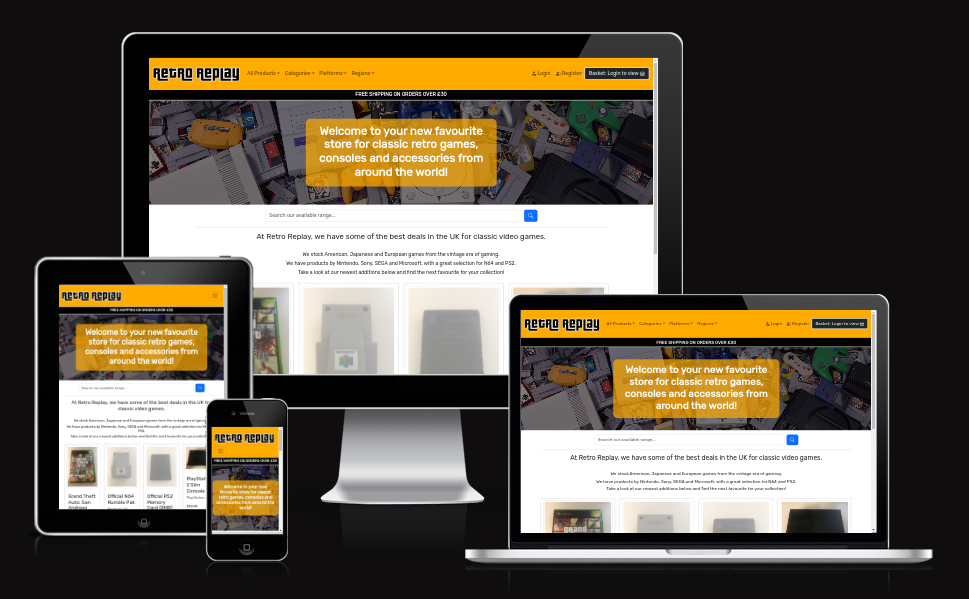

[Click here to view the deployed site!](https://pp5-retro-replay-f8ca18b6956c.herokuapp.com/)

<details>
  <summary>Click to reveal QR code for easy mobile access!</summary>
  
</details>

The table of contents can be accessed at any time by selecting the menu icon at
the top left of the screen, next to 'README.md'.

Links can be opened in a new tab with a right click, middle click or Ctrl + click.

Getting the most out of this web app requires a verified account. If you would
like to use all features of the site without using a personal email address,
[temp-mail](https://temp-mail.org/) can provide you with a disposable email address.

To simulate making a payment on the store (you will not be charged), please use
one of the following codes:

| Card number         | Triggers action          |
| ------------------- | ------------------------ |
| 4242 4242 4242 4242 | Visa success             |
| 4000 0025 0000 3155 | 3D Secure authentication |
| 4000 0000 0000 0002 | Generic decline          |

View the [full test card reference](https://stripe.com/docs/testing) by Stripe
for other methods.

## Project introduction

Retro Replay is a web-based e-commerce platform, powered by Django and Stripe.
It operates on a B2C model, where customers can pay by card for either one or
multiple items in the store. Items are added to their basket, followed by a secure
checkout page. The user is provided with an order confirmation email and they
may view past orders on their profile page.

Additionally, role-based CRUD functions are implemented to benefit the customer.
Customers may store, modify and delete saved addresses on their profile and
nominate one as their default address to speed up their next checkout. There are
lines of support available to customers, facilitated by the FAQ/Contact section.
The administrator can easily create, update and delete FAQ entries entirely from
the front end.

This application expands on my previous [full stack application](https://github.com/jts272/pp4-safe-hands-guitar-tech)
with a complete SEO and marketing campaign, utilizing Facebook and Mailchimp.

## Project context

The objective of this project is to apply the last 12 months' study of full
stack software development to create a modern, intuitive and secure e-commerce
application. This involves thorough planning, with good working knowledge of the
technologies employed and the ability to solve problems gracefully.

This app uses the most up-to-date implementation of [Stripe](https://stripe.com/docs)
address and payment elements. A lot of care was taken to study the API to integrate
it with my knowledge of Django design patterns. Speaking of patterns, this is
the payment flow used for Stripe payment integrations:

### Stripe payment pattern

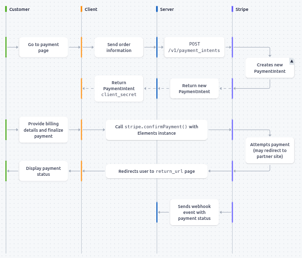

There is a lot of interaction between the front and back ends. Serious consideration
must be taken regarding how data is passed around. It became clear that building
`JSON` data structures was the best approach. This ties in with the use of custom
[webhooks](https://stripe.com/docs/webhooks) to trigger certain actions from Stripe's
response. The basket concept utilizes [Django sessions](https://docs.djangoproject.com/en/3.2/topics/http/sessions/)
to handle its data.

Here is a general overview of how this pattern fits into the whole picture:

1. An authenticated user browses the store, with clearly defined sections and
   search functionality.
2. They select the items they would like to purchase, are notified of the quantity
   of items in the basket and are offered a link to proceed to the basket summary.
3. The customer is shown live updates of their basket subtotals. A delivery incentive
   value is calculated to encourage spending targets.
4. At the checkout, the customer can fill in their address details with the assistance
   of either the Google Maps API, or with an address pre-saved on their profile.
5. A secure, validated card payment is taken. On success, the order and its
   associated data is stored in the database.
6. The customer is notified of the successful payment, the ability to view their
   full order history in their profile page and are sent a confirmation email.

This outlines the core shopping loop of the application, as different site
functions interact to give an excellent customer experience.

### AJAX

Using a customer-first design philosophy, it was decided to use the technology to
create a snappy, responsive app that reduces friction to provide a great online
shopping experience. To this end, adding and removing items to and from the basket
is asynchronous. This was achieved with using either jQuery or the Fetch API, in
conjunction with JSON data and views.

The end result of this is that the customer can perform their actions smoothly,
whilst having the UI update to reflect the current state instantly.

### Original design

Ultimately, this app serves the needs of the client and his customers, whilst
being a brilliant learning opportunity. There were many new concepts to explore
to bring this vision to life, which was a great challenge. An original brand
design was made, yet site interaction should feel familiar to users of online
stores.

The latest version of [Bootstrap 5](https://getbootstrap.com/docs/5.3/getting-started/introduction/)
was employed to scaffold out the site in a mobile-first manner. Users of all
screen sizes will enjoy the site experience, without compromise.

Aside from the code, much effort was placed in the business end of the equation.
We will explore the techniques employed to expand the client's reach as an e-commerce
entity with a well-defined target market.

### Unique constraints

Unlike a typical e-commerce store that has multiple given stock items that are
readily replenished, each item sold in the store is unique. As each item is a
single unit, the system had to be built from the ground up to accommodate for
this.

When an order goes through, any associated order items are flagged as sold. This
affects how the product listing can be found. The homepage shows the four most
recently added products to the store, which may include sold products. This creates
a sense of urgency for first time visitors by giving the notion that stock is
limited. All sold products can then be found in their own dedicated section. This
keeps all site links easily accessible, without cluttering the customer's searches
for available items.

In response to this unique requirement, each product's endpoint is generated from
an automatically incrementing slug field. This creates a clear, semantic url for
the product, whilst avoiding url clashes where products share the same name.

---

## Agile methodologies

An agile methodology was employed from start to finish in this project. For a
detailed breakdown on the implementation, please consult the
[agile methodologies breakdown](https://github.com/jts272/pp4-safe-hands-guitar-tech#agile-methodologies)
outlined in my previous full-stack production. There you will find a thorough
explanation of each component, how to read the visualizations and how they benefit
the development process.

Here are the links to the agile resources for this project. GitHub project boards
are best viewed in 'Board' layout, with the 'Labels' field enabled.

- [Issues](https://github.com/jts272/pp5-retro-replay/issues?q=is%3Aissue+is%3Aclosed)
- [Milestones](https://github.com/jts272/pp5-retro-replay/milestones?state=closed)
- [Projects](https://github.com/jts272/pp5-retro-replay/projects?query=is%3Aopen)

---

## Five stages of UX design

### 1. Strategy

This application is designed to serve the needs of a client that is starting a new
B2C small business. The product is retro video games from the mid-2000's and prior.
The client has no premises overhead and wants an online platform to sell his
products, whilst expanding his audience reach.

The client's target market is mainly well-informed collectors. They generally
know what they are looking for, so the strategy is to make browsing the site
very logical, whilst providing prospective customers with the details they would
be interested in.

One advantage that Retro Replay offers over high street retailers such as
[CeX](https://uk.webuy.com/) is that it sells products from regions outside the
UK. Games from Japan or the US varied much more in the retro-era and are a
commodity to collectors.

When auditing the competition, [ConsoleMAD](https://www.consolemad.co.uk/),
[Retro Games](https://www.retrogames.co.uk/) and [Amazon](https://www.amazon.co.uk/)
were used to gauge functional expectations. The intent is to provide a smooth,
essential navigational experience, whilst building trust that leads to successful
conversions.

### 2. Scope

As an e-commerce application, the following MVP features were identified:

- Logical product category list pages.
- Product detail page with relevant information.
- Role-based authentication and authorization.
- Add to basket > Checkout flow.
- Secure payment integration.
- An integrated SEO and marketing campaign, to expand brand reach.

In addition, front end CRUD functionality is available to both customers and
admin. The intent is to allow both parties to control their relevant data
easily, with a pleasant UX. The admin can easily control the content in the FAQ
section, whilst customers can manage their addresses.

The client, whom will serve as the admin, is familiar with the Django administration
system and wanted a reliable way to manage site data. Product management operations
are conducted on the admin site, as well as the monitoring of customer queries.
Customer queries can easily be made by authenticated users on the front end.

### 3. Structure

Interaction design is critical, especially where payments are concerned. The
navigational flow is consistent, which comprises:

- A responsive header, with product categories, authentication controls and basket
  information.
- Main page content. For example, product pages have a search bar and the selected
  product list.
- A footer with support, marketing and call-to-action social links.

By using the navbar, customers can access the majority of the site in no more
than two clicks. Support is readily accessible in the footer by convention.

Feedback is offered on all interactions, leaving nothing to chance. Examples
include:

- Notifying of login status.
- Informing when an item was added to the basket, with a link to view the basket.
- Confirmation prompt for the deletion of a saved address.

Overall, navigation is intended to feel familiar to users of e-commerce platforms,
whilst keeping them informed every step of the way. By keeping things predictable,
the user can focus on simply finding and purchasing their desired product.

### 4. Skeleton

A mobile-first approach was taken as standard, which is also advantageous in the
app's SEO efforts. Design was optimized up from the resolution of 375x667 pixels and
tested all the way up to 2560x1440. Screens as small as 320px in width lose no
functionality, however the burger menu icon is wrapped below the brand header.

To start the navigation story from the home page, the navbar is stylized in such
a way that fans of the [Grand Theft Auto](https://en.wikipedia.org/wiki/Grand_Theft_Auto)
franchise will instantly recognize. Combined with the product category and basket
controls, this alone sets the tone as a place to purchase gaming related goods.

An eye-catching hero image solidifies this notion with a vast array of the sorts
of products that are sold. This is covered with SEO-rich keywords to drive the
point home.

A selection of the newest products are shown. First-time visitors can get a feel
for the products sold, whilst repeat customers can quickly see what is new.

A search bar is present on both the home page and product category list pages.
This serves as a filter for the currently selected category, whilst the home page
search bar functions as if the customer searched for all available products.

The typical list > detail view pattern is used for customers to find a product
and easily add it to the basket.

Basket and Checkout pages are intuitive. The checkout page employs the latest
Stripe address and payment elements, complete with validation.

A profile management dashboard is available to authenticated users to manage their
addresses, or view past orders. They are fully informed throughout the process,
wether they have none or multiple addresses. The order history also follows the
familiar list > details pattern.

The following wireframes were produced to plan the skeleton that would form each
section's code, using [Miro.](https://miro.com/app/dashboard/) Pages were developed
in mobile format first then scaled to desktop width. However most wireframes are
depicted in desktop format for the sake of clarity. The mobile home page wireframe
is displayed with the navbar menu expanded.

#### Home page - mobile and desktop

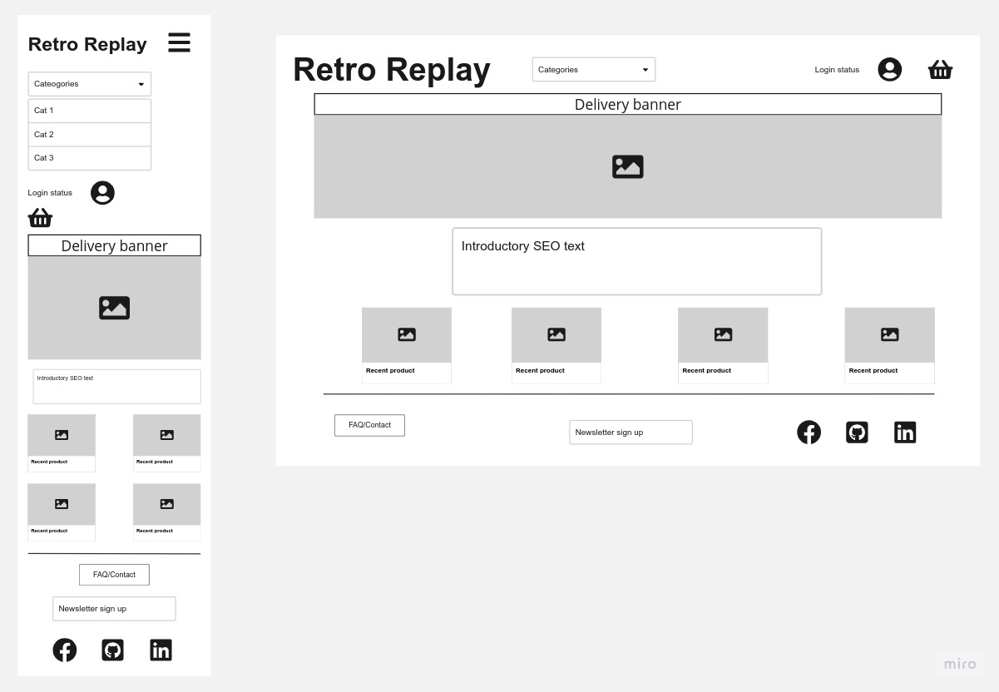

#### Product list - desktop

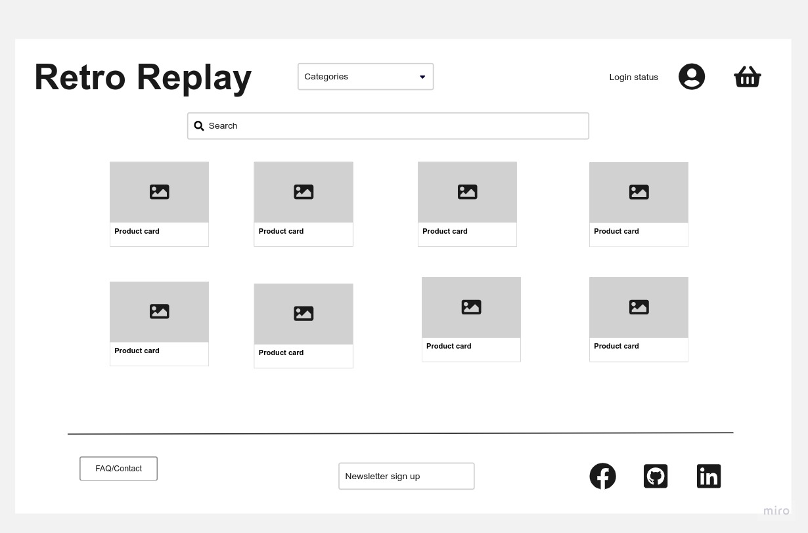

#### Product detail - card

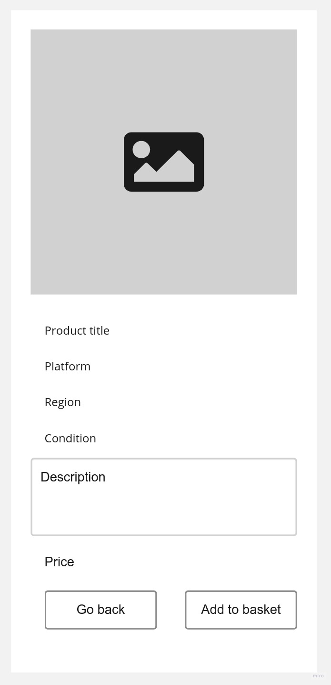

#### Basket summary - card

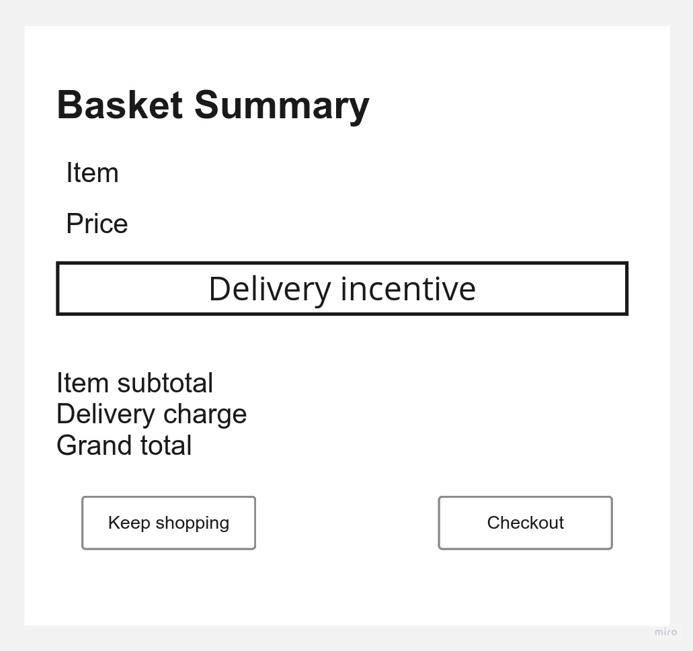

#### Checkout - card

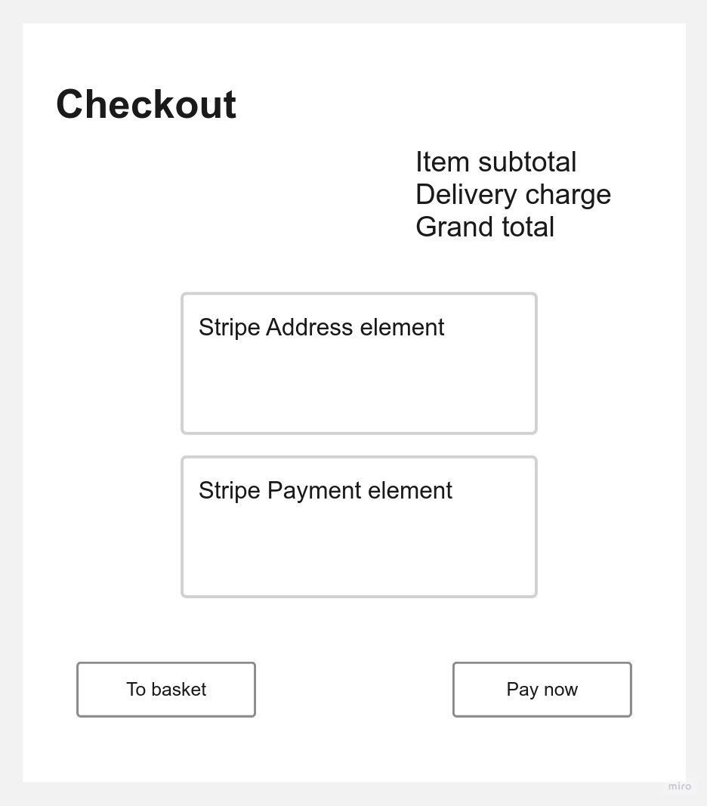

#### Support - desktop


#### Saved addresses - desktop

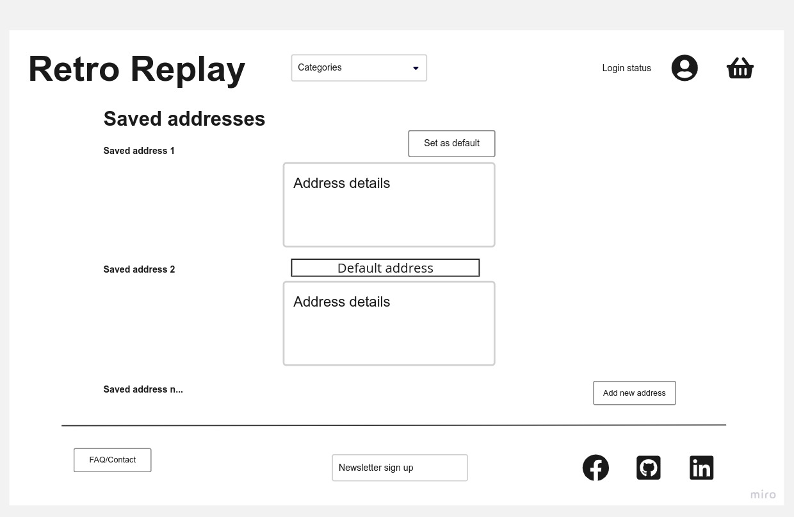

#### Order history list - desktop


#### Order history detail - desktop

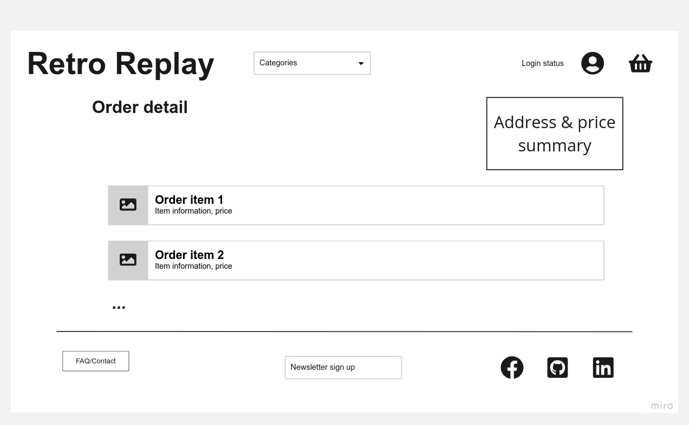

### 5. Surface

#### Colour

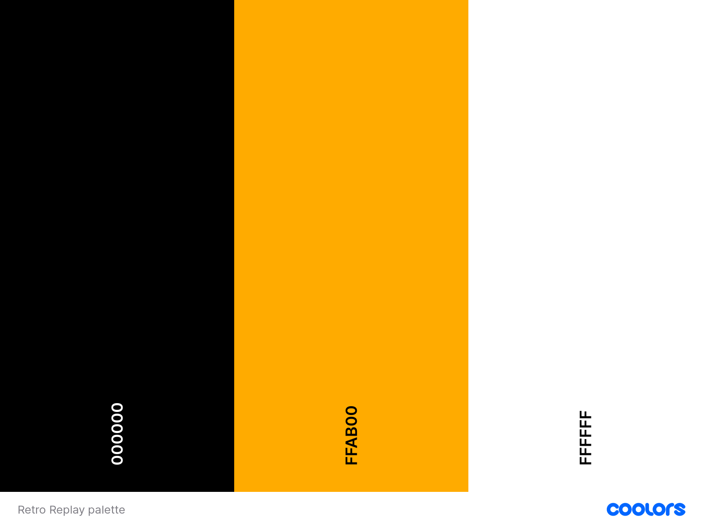

Colour palette generated at [coolors.co](https://coolors.co/)

Staple black and white was used, with a brand colour reminiscent of
[Rockstar Games.](https://en.wikipedia.org/wiki/Rockstar_Games) In addition,
the semantic colours from [Bootstrap 5](https://getbootstrap.com/docs/5.3/getting-started/introduction/)
were used on buttons and alerts.

The client wanted to use a warm colour tone that looks familiar to seasoned
gamers, without associating with any game platform in particular.

#### Typography

Two fonts are in use:

- [Pricedown](https://www.cdnfonts.com/pricedown.font)
- [Rubik](https://fonts.google.com/specimen/Rubik)

Combined with the colour palette, Pricedown font creates an instant link to the
gaming theme at first glance. It also evokes the retro theme of decades gone past.

Body text is represented by Rubik. It is an easily readable sans-serif font, with
playful rounded edges. This is somewhat similar to the body text in use at
[Nintendo's](https://www.nintendo.com/) official site.

#### Imagery

When providing vintage products to collectors, it is import to provide high-quality
images of the product in question. These were taken from the client's own stock.

The eye-catching hero image was used from a [bossrush.net](https://bossrush.net/2022/07/09/collecting-retro-video-games-is-a-waste-of-money-for-me/)
blog post.

Region flag icons were sourced from [flaticon.com](https://www.flaticon.com/packs/countrys-flags)
to provide a bit of visual flair and context to the region codes. Most collectors
would be familiar with such terms, however this helps to reinforce the intent.
An icon to represent items not found was also sourced from here, although all
current listed products have images present.

Game over 404 image was sourced from [unsplash.com](https://unsplash.com/photos/By-tZImt0Ms)

#### Text content

All text content is originally provided from the client. This includes things such
as:

- Product titles
- Categories
- Product descriptions
- FAQs

In addition, short and long-tail keyword research was undertaken. High-value terms
were implemented in HTML header tags on the homepage to maximize SEO efforts.

Iconography to support text content comes from [Bootstrap Icons.](https://icons.getbootstrap.com/)
A customized SVG was generated from [icons8](https://icons8.com/preloaders/en/search/pac+man)
for the Pac-Man style payment processing icon.

---

## Features

### Navbar

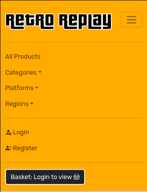

A fully responsive navbar is employed at the top of the site. This includes links
to product categories, authentication controls and basket information. Until the
user is authenticated, all features requiring authentication will redirect the
user to log in when clicked.

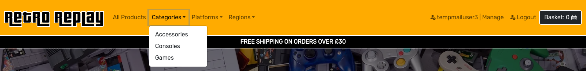

The desktop navbar features dropdowns for the user to navigate straight to their
selected category. When logged in, users can go to the profile management page
or view the status of their basket.

### Sign in page

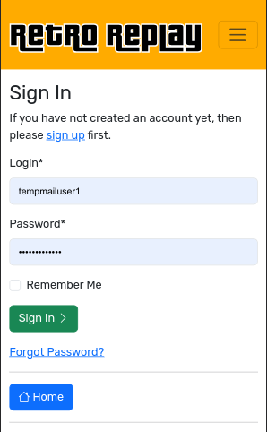

This is the user's entry point to interaction with the site and their data.

### Sign out page

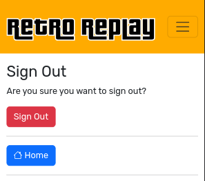

When the user is finished, they may sign out securely.

### Sign up page

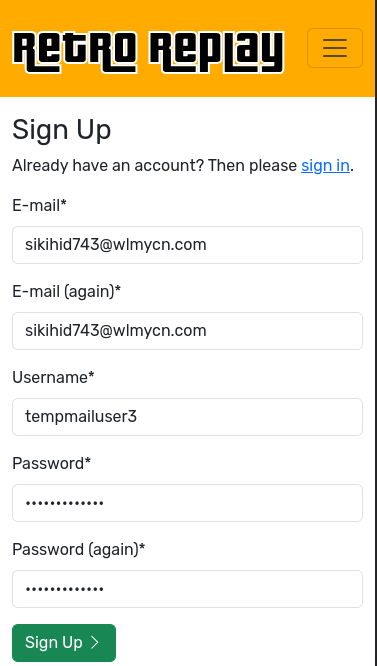

Sign up requires an email address, username and password. All must be confirmed
to filter out user error during the sign up process.

### Email verification sent

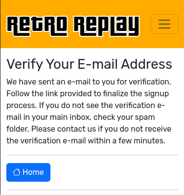

The email address provided must be verified before the user can access the site's
functions requiring authentication.

### Email verification received

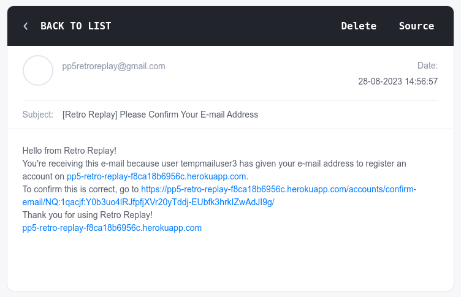

The confirmation email is sent to the email address provided at the sign up process.
The link included in the email is used to go back to the site and confirm the
verification.

### Email verification confirm

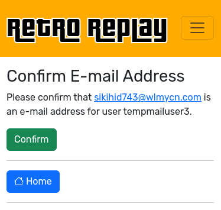

Here the user confirms that the email address is correct. Upon confirming, they
are redirected to the sign in page.

### Hero image - mobile


Atop the hero image is a banner notifying users of the free delivery threshold.
The hero image itself hints at the wide range of products available, which is
darkened to improve contrast.

### Home page

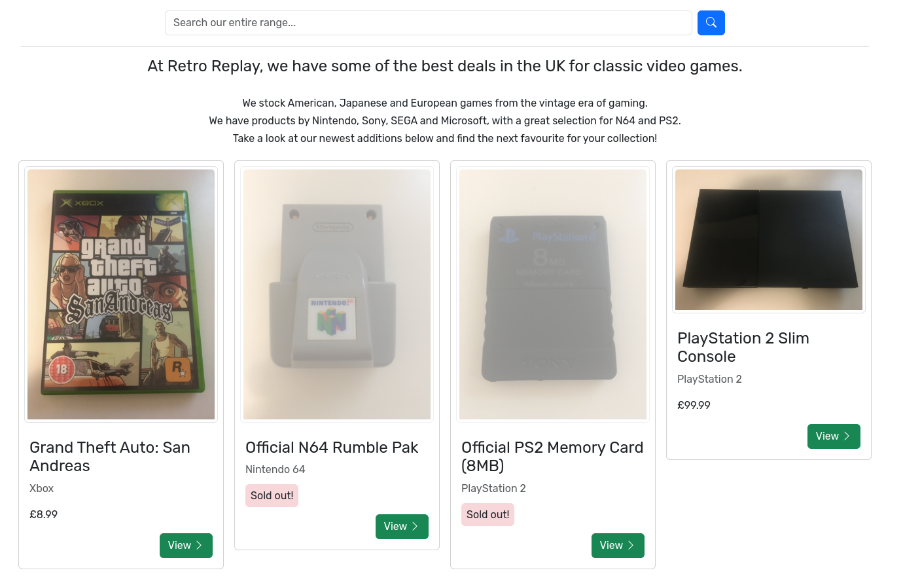

A search bar invites the user to search for any product in the store. Introductory
text reinforces the site's purpose, which further implements relevant SEO terms.
The four newest products to the store are depicted here in list-card format, with
a call-to-action to view the product in more detail.

### Footer - mobile

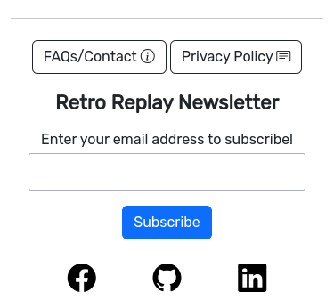

In both mobile and desktop view, the footer holds links to valuable support resources.
Firstly is the FAQs/Contact button, which links to the support page. The externally
hosted privacy policy is viewable.

Users can opt-in the the Newsletter, powered by Mailchimp. Also included are
social call-to-action buttons, which link to Facebook, GitHub and LinkedIn,
respectively. Links open in a new window and context, thanks to properly assigned
HTML attributes.

### FAQ/Contact page - user

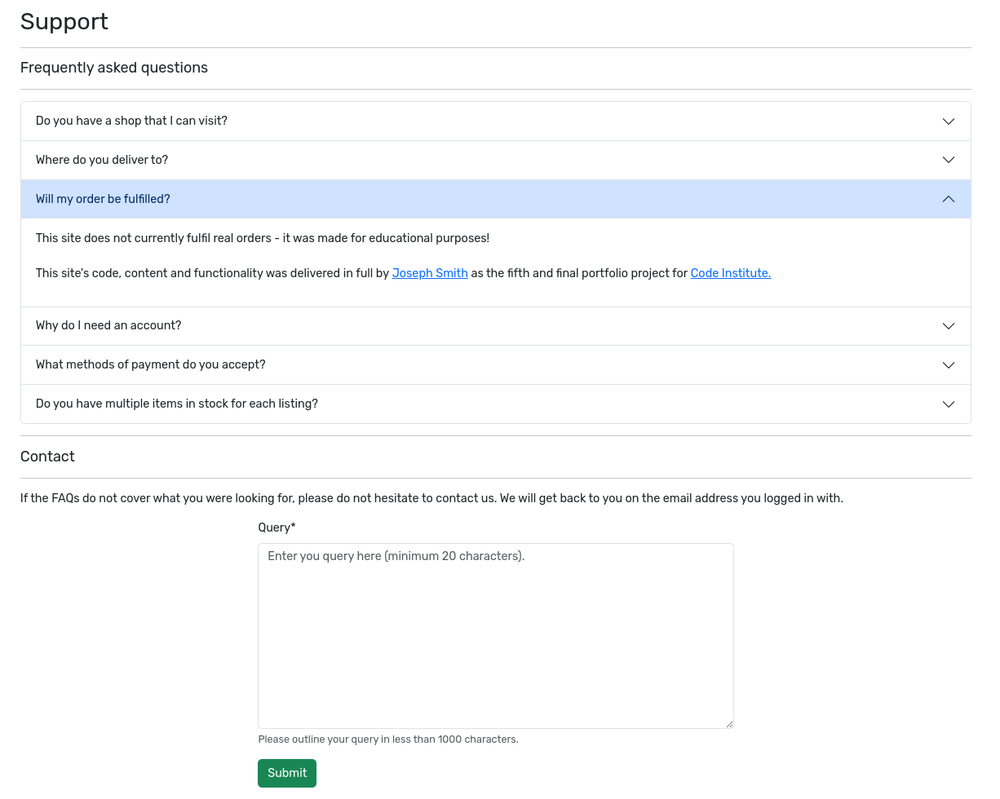

This page is the user's first line of support. An accordion details frequently
asked questions, where users can view the associated answer.

If they would like to message the admin directly, they can do so with the query
form that follows.

### Contact query - received by admin

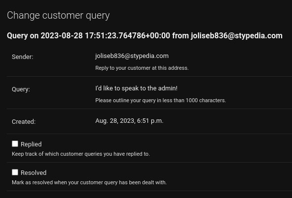

The client wanted to ensure that customers were able to reach him privately and
securely if they encountered any issues. A return email address is provided, which
comes from the logged in user's credentials when they make a query, without
requiring them to input it manually.

It is possible to keep track of wether the customer has been responded to and their
query resolved. This feature is currently the admin user's responsibility to
monitor and can be fleshed out as a front end feature in future iterations.

### FAQ/Contact page - admin

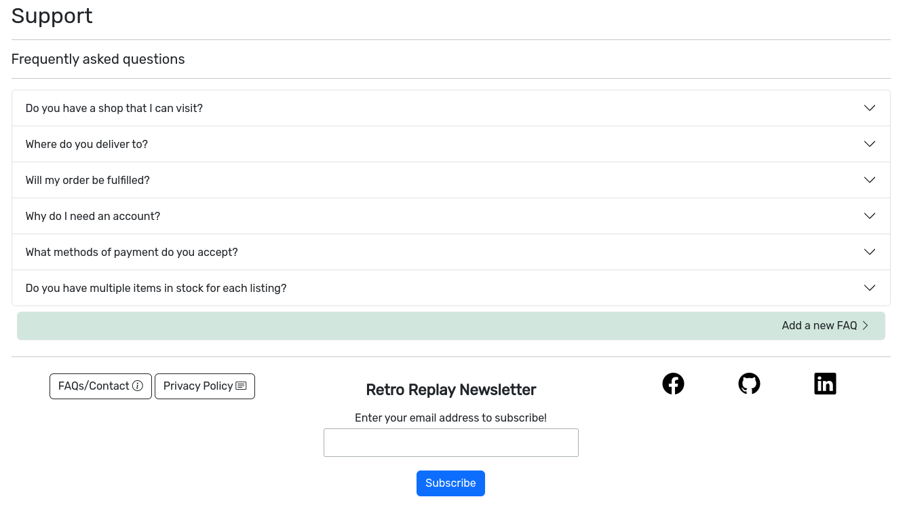

For the administrator, there is no admin contact form. They do however gain the
ability to quickly add edit and delete FAQ entries from the front end.

### FAQ form

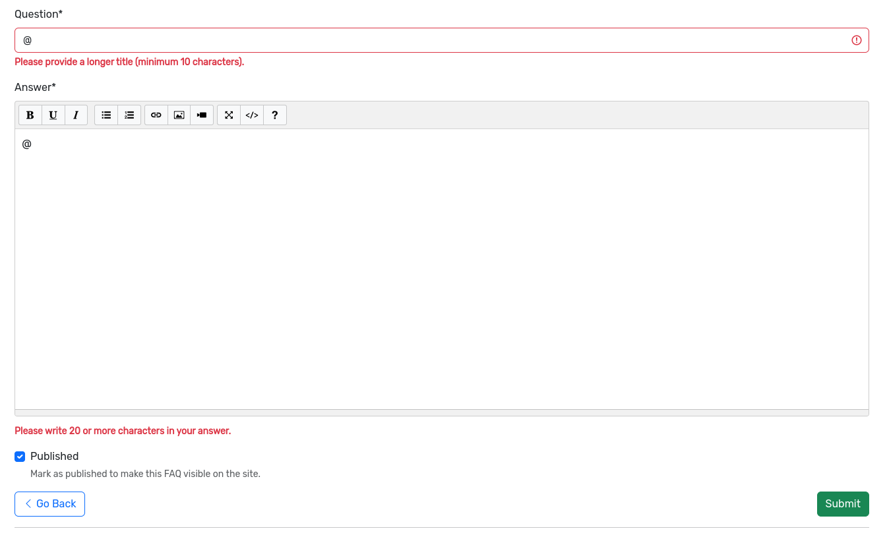

The form for admin to add a question is shown here, with validation in effect.
The answer field makes use of a custom [Summernote](https://github.com/summernote/django-summernote)
form widget. This provides an advantage over a standard text field by enabling
WYSIWYG editing for elements such as lists or links.

This is also used in the admin panel for the product detail field, which is currently
used to create product listings on the site for selling.

### Privacy policy

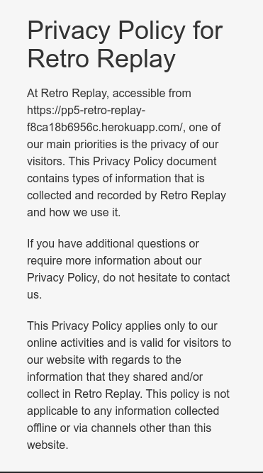

The site's policy was created at and hosted by
[privacypolicygenerator.info](https://www.privacypolicygenerator.info/)

This keeps customers properly informed regarding GDPR and their usage of the site.

### Product list page

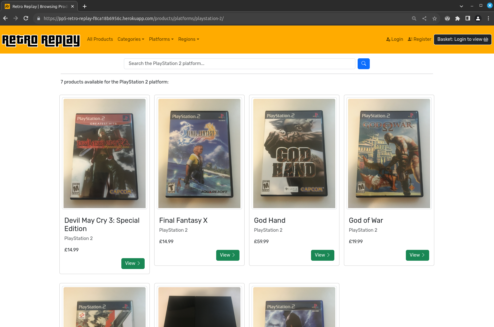

The full browser window is displayed in this image, to bring attention to the
url path. Urls have been designed in accompaniment with the models to make for
informative, semantic paths. Here depicts the 'products' app, the 'platforms'
section, then finally the 'filter' - which is the model's name in slug format.

To illustrate another example, a user would navigate to
`/products/regions/ntsc-j/` when they select that particular selection from the
navbar. This leverages Django's design patterns to produce meaningful canonical
urls.

### Product search bar

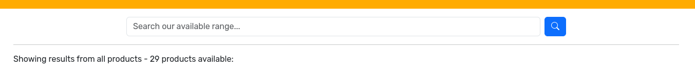

All product list pages have a search bar that the customer can use to narrow down
their search results. It takes into account other key attributes of the searched
product such as words found in the description, to give the customer relevant results.

### Product list page - sold products


During development, a feature to allow searching for sold products was implemented,
then reverted as it was predicted to not see much use and was quite distracting
in terms of UX flow. However, this did become a must-have for the client in the
later cycles of development so the ability to navigate to sold products was
re-introduced in a far less intrusive and more logical way. The navigational
element for all products was refactored into a dropdown so users can clearly
make their choice in terms of looking at sold or available items.

### Product detail

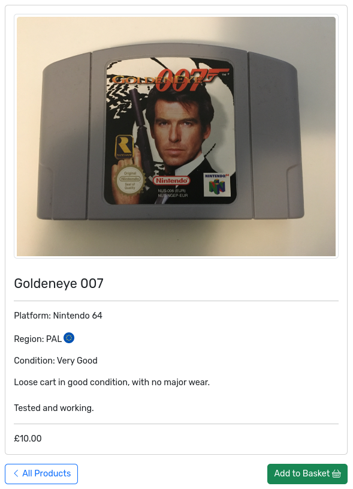

All pertinent information on the product's specifics are outlined in the card.
Various actions are available, depending on authorization status, or 'in-basket'
status. A logged in user whom does not have the current product in their basket
can add it from this page.

### Log in to buy - mobile

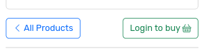

Unauthenticated users are linked to the login page by a conditionally rendered
button.

### Product added to basket

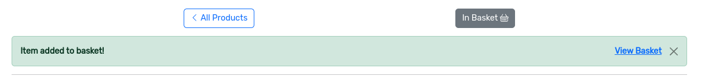

Users are notified that the product has been added to the basket when the add to
basket button is clicked and are offered a link to view their basket. This message
auto-dismisses after a time or can be dismissed manually.

### Product already in basket

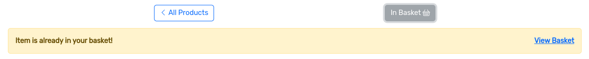

If users attempt to re-add the item to the basket, or navigate back to a product
detail page where the item is already in the basket, they are given the appropriate
message. This message will stay present with no option to dismiss.

### Product detail - slug

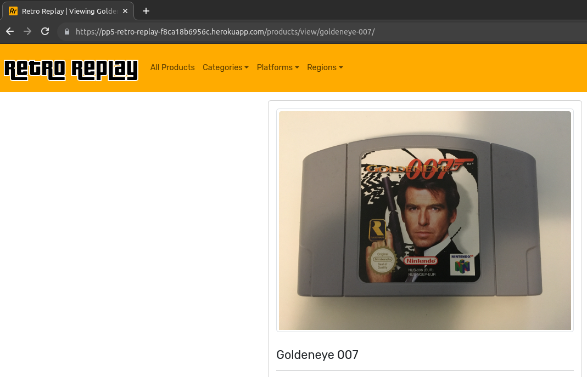

As with product listings, the product detail card has a logical endpoint. I had
the idea to use an auto-incrementing slug field, as it is very realistic that
a second listing for a game of the same name could be made in the future.
Thankfully, such a field exists and was implemented using the excellent
[django-extensions.](https://django-extensions.readthedocs.io/en/latest/field_extensions.html)

The provides a nice human-readable endpoint for products, rather than the product's
primary key, or other such non-semantic identifier.

### Basket - dynamic calculations

The following examples demonstrate the calculations that are performed on the items
in the current basket. Note that the basket quantity in the top right reflects
the current number of items in it.

The delivery threshold is taken into account and an appropriate message is displayed.
If the threshold is not met, the user is prompted on how much more they could spend
to qualify for free delivery.

When 'Remove' is clicked, all changes occur instantly thanks to the AJAX implementation.
All calculations are performed to correctly display the new figure. This is similar
to deleting an item from the basket at Amazon, where the response is instant.

A button on the bottom left links back to the full product list, should the user
want to add more items before checking out.

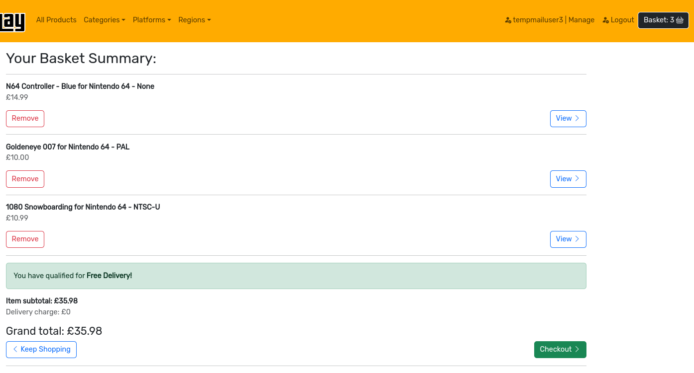
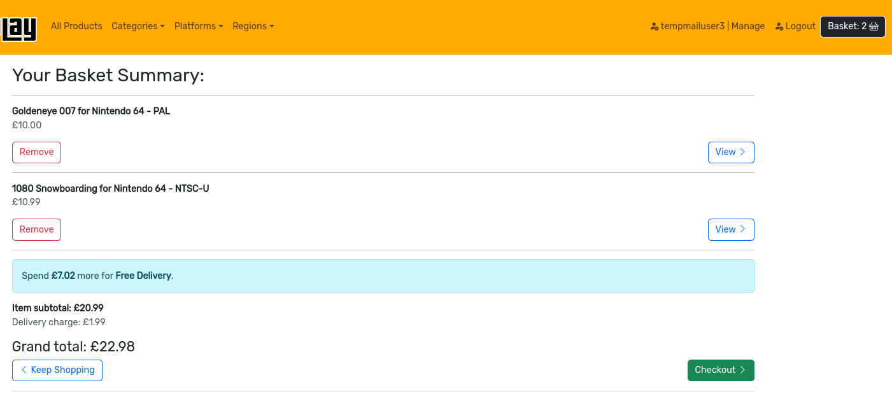
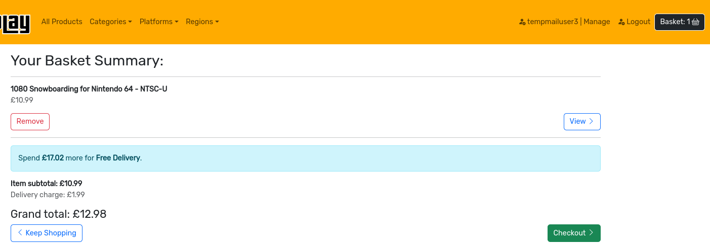
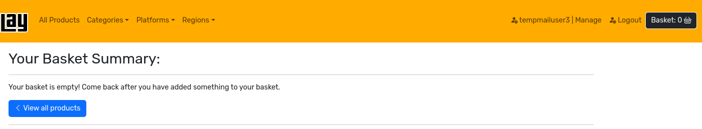

### Checkout

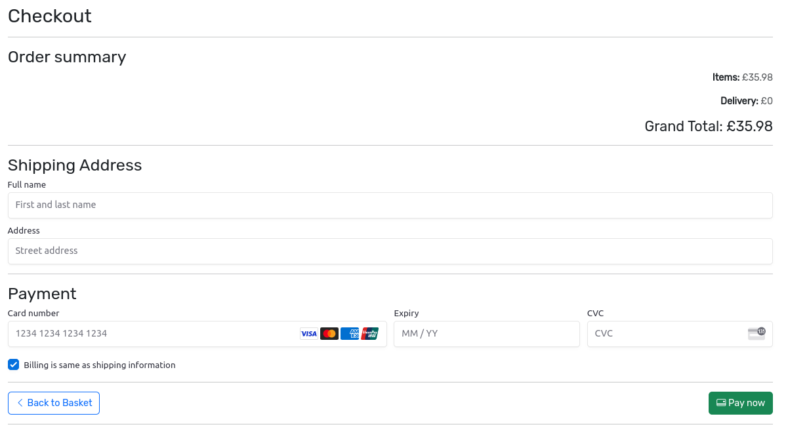

Stripe provides APIs for address and payment elements, the latest of which were
used in this payment integration.

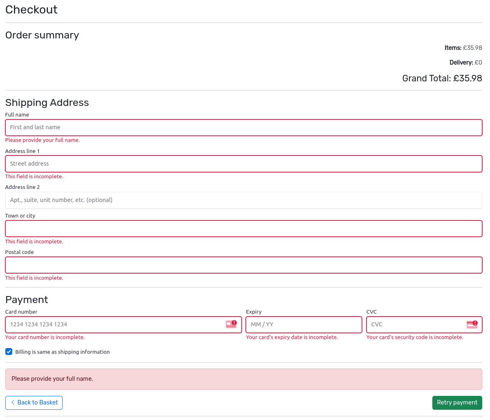

Full form validation is in effect. An alert is shown above the payment controls
to communicate the most recent error to be fixed.

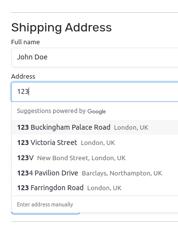
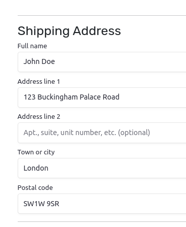

The address element utilizes the Google Maps API to help the user autocomplete
their address.


3D Secure payments are supported, as an extra layer of security. Whilst the API
logic is running, the 'Pay now' button is changed to 'Processing', with an
animated SVG of Pac-Man to indicate the processing status.

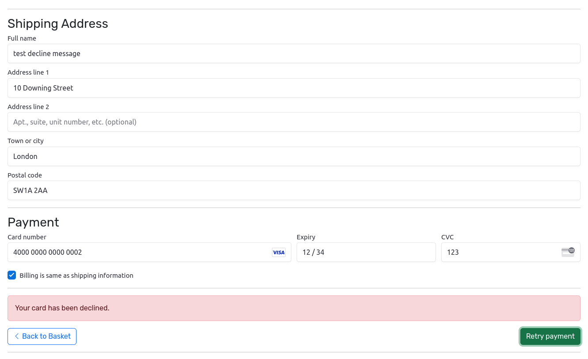

A message is shown in the event that the card is declined. The form stays as-is
and the button text changes. This suggests that they can retry the payment, without
losing the form progress they have made.

### Checkout summary

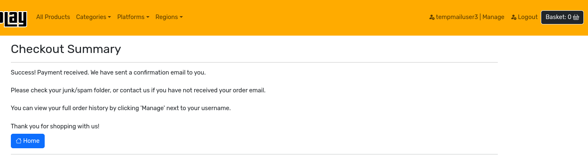

Upon payment, the user is redirected to the checkout summary page. They are notified
that they will be receiving an email confirmation and that they can view the full
details of their order history on the site.

Note that the basket is emptied when the transaction is complete and the counter
is set back to zero.

### Checkout confirmation email

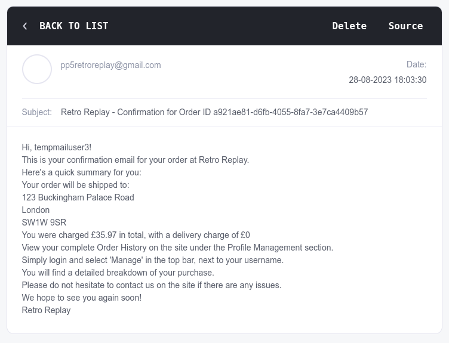

Order details are confirmed in an email sent after payment succeeds.

### Profile

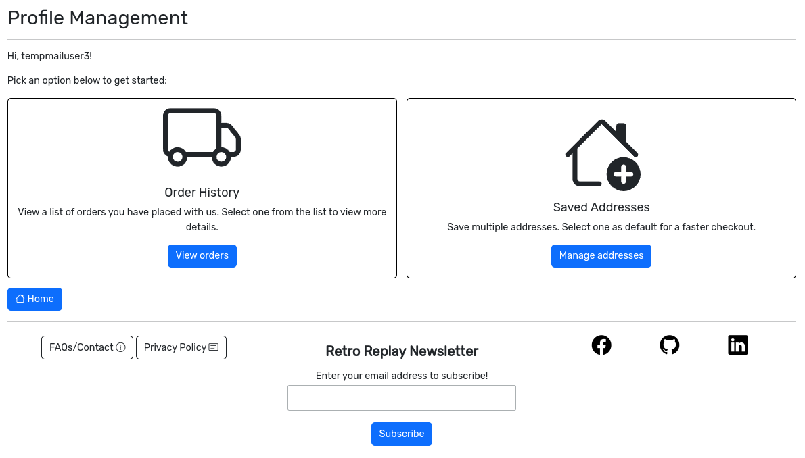

Profile management serves as the dashboard for regular users' CRUD functionality.

### Order history list page

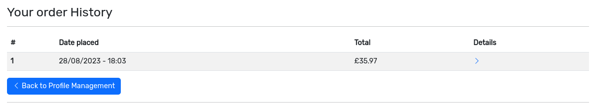

A user's list after their first order

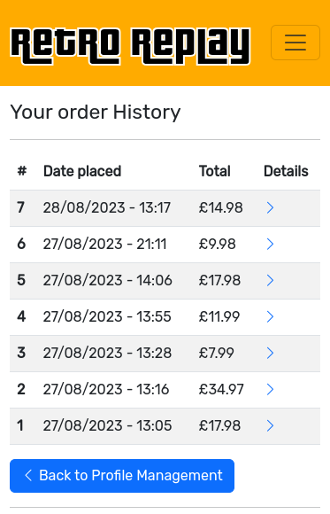

This list grows as orders are added. Here are the orders placed for a different user.

### Order history detail page

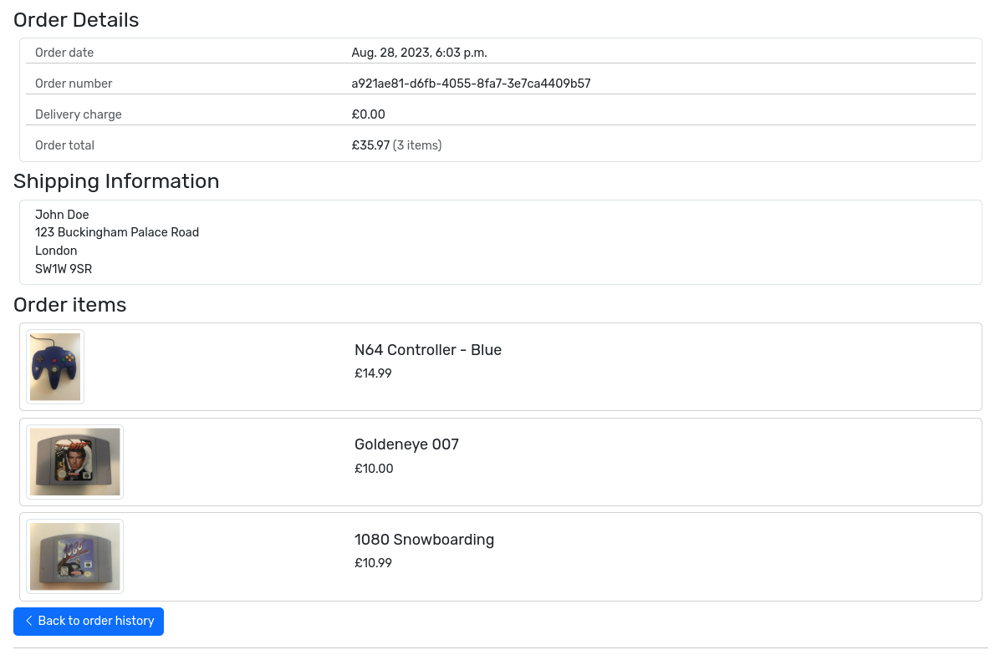

Here is the full report of the order, in the form of an itemized bill, with
shipping information.

### Saved addresses - none

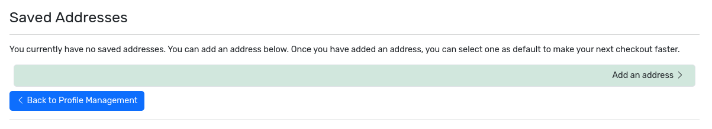

New users with no saved addresses are greeted with this screen. They are prompted
to select an address as default to speed up their next checkout process, where the
address section of the form with be automatically filled when the saved address
data is passed to the Stripe address elemnt as it is built.

### Saved addresses - one, no default set

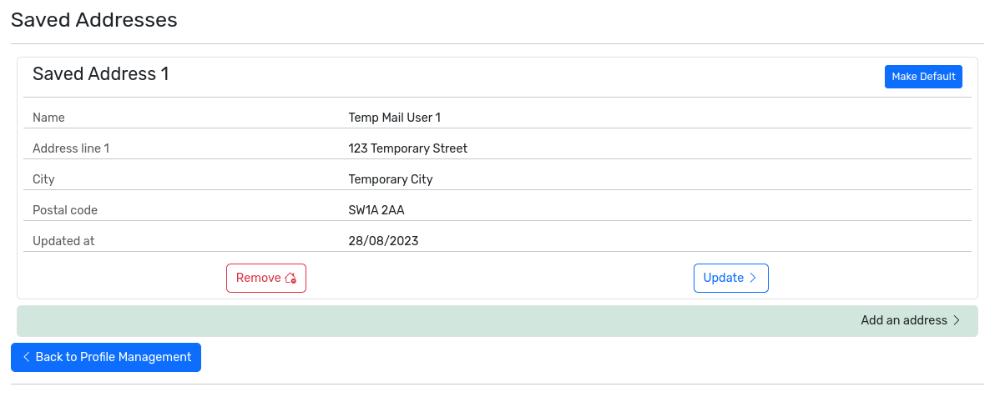

In this example, the user has one saved address, but no default set.

### Saved addresses - two; first set as default

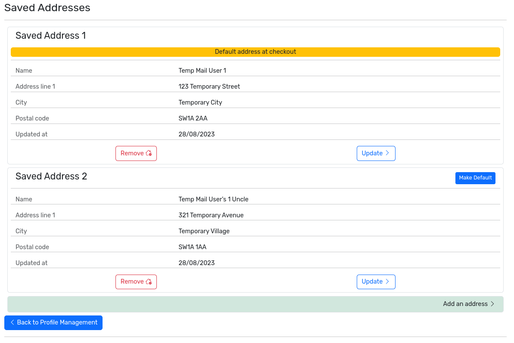

Here, the user has added a second shipping address and nominated their first
as the one they'd like to use next checkout.

### Error page - 404


Navigating to a non-existent page on the domain produces a custom 404 error page.
In all instances or error pages, the user is offered a prominent link back home.

### Error page - 403


In this instance, a non-admin user is attempting to access a page that is restricted
to superusers. Again, they are informed of what has occurred and guided back home.

### Error page - 500


Sever errors are also handled with a custom page. This situation was replicated
by the admin user trying to access the address edit page of another user.

### Favicon


[favicon.io](https://favicon.io/) was used to generate a favicon for the site,
using an abbreviated version of the brand for lettering with matching colours.

### Feedback system

Feedback messages have been implemented using a combination of the Django messages
framework and custom JavaScript. It is used to highlight that key actions have
taken place.

An example is shown below when a user updates one of their saved addresses:


Or when a user performs an authentication action, such as logging in:


This system is employed in all situations were CRUD operations are concerned. The
basket is handled differently, however. The basket uses AJAX for instant feedback
by manipulating the targeted elements, such as removing an item from the basket
and adjusting subtotals accordingly.

The client wanted customers to experience a modern, frictionless experience around
payment. It was decided at the planning stages to use an approach that does not
require refreshing or any database operations to handle the customer's basket.
The idea is for them to enjoy browsing or searching in a logical manner, then to
have a responsive, secure path to payment.

---

## Web marketing campaign

### Facebook

Multiple approaches were undertaken to aid in marketing the business. First, a
Facebook business page was created:


Reciprocal links are present to link the site and Facebook page. This is another
avenue for interacting with current or future customers, whilst spreading
word-of-mouth as the business gets off the ground.

A brand icon was sourced from [Pixabay](https://pixabay.com/vectors/video-game-cursor-keys-control-icon-1294541/)
which uses matching brand colours with a classic game controller motif.

As the business grows, so too will the Facebook page. The aim is to provide a steady
stream of relevant, high-quality content that will get people interested in the
store.

### Newsletter

In addition, a newsletter campaign was created with Mailchimp. This uses an embedded
form in the footer of every page for users to opt-in to mailing list updates.


The launch newsletter has been pushed to subscribers. They received the following
email:


Combining these tools allows the client to target existing customers with relevant
information, whilst expanding brand outreach to gain more customers. As a new
B2C online retail store, it is critical to spread awareness in order to increase
the amount of potential revenue streams.

## SEO implementation

Search Engine Optimization efforts were stepped up in this application compared to
previous ones. Keyword research was undertaken to identify 'short-tail' and
'long-tail' search terms. These refer to popular, competitive terms and more
specific, targeted terms, respectively.

After conducting this research using the Google search engine, high-value terms
and phrases were listed. These terms were placed in high-impact HTML elements
such as header tags on the home page. This shows the indexing engines of that
such terms are a key focus of the site, in effort to boost ranking on the
search index.

Appropriate use of meta tags were employed in the head element, such as a description,
keywords and dynamic page titles across the site. Outgoing links, such as those
to Facebook were given an attribute to signify that the page is opened in a new
context and is not relevant to its origin as far as search indexing is concerned.

An XML sitemap was generated at [XML-Sitemaps.com](https://www.xml-sitemaps.com/)
to aid search engine spiders in indexing the site. This works in conjunction with
a file called `robots.txt` which tells the spiders to ignore certain sensitive parts
of the site, such as those related to payments or profiles. The presence of this
file inherently boosts the site's perceived quality for the indexing algorithm.

This is all tied together with meaningful url design, as mentioned in the product
detail features section. By using these basic tools well, I give the client a
big boost in terms of the site's relevancy on the web.

---

## Data modelling

Database schema diagrams were produced with [graph_models](https://django-extensions.readthedocs.io/en/latest/graph_models.html)

The following graphs outline the entire relational database system of the application.
First is the data model in totality, followed by a breakdown into smaller, related
fragments. Arrow colour designates the cascade effect when a model instance is
deleted, with red relating to deletion and yellow to setting null.

### Complete schema


### User-Profile schema


A common pattern in Django is to create a one-to-one link from Django's stock
user model to a customized 'Profile' model. All instances of `Profile` are
intrinsically linked to `User`

### Product schema


An e-commerce platform needs a product to sell and this plan was made to allow for
the product to have certain attributes added to it from foreign key (FK) tables.
An example use case would be adding a new `Platform` when listing a product whose
platform is not already created.

Of special note is the product model's auto-incrementing slug field, that is designed
to avoid url clashes where products share the same name. When a product is sold,
the boolean is set and it is moved from the standard product list to the sold section.
Visibility can also be toggled, should the listing need to be quickly added or
removed from display.

### Order schema


With products in place, orders can be created. An `OrderItem` model complements
the order, so that itemized bills can be provided to customers. Order entries are
ultimately created from data that is passed to and from the Stripe webhook on
successful payment. The order item has access to the related product by its FK.

### Profile schema


The profile is where users have full CRUD control over their address list, or can
view full itemized reports of past orders. The `default` boolean of the address
model designates which one will pre-fill the Stripe address element at checkout.
The order model has access to its related order items.

### Support schema


Finally, the support schema houses two unrelated models aimed at providing support
to the customer base. FAQ entries can easily be created, updated or deleted in
the front end by the admin.

The customer query model exists to provide a direct line of support for customer
to admin. On the front end, logged in users only have to provide a valid query,
whilst the admin can use the booleans to keep track of the customer query's status.

---

## Testing

A robust testing regimen has been implemented during the application's development.
On the server side, a large battery of unit tests were conducted across every app.
The [coverage](https://pypi.org/project/coverage/) package provided a framework
to discover which elements needed to be tested.

Integration tests were conducted to assess that the combination of moving parts
of the e-commerce platform works in harmony. Thorough manual testing was undertaken
for elements that were not, or could not be covered with unit tests.

### Automated testing

The overall test results and coverage for every app is shown here, followed by
an app-by-app breakdown. 55 tests were conducted and passing, with a 91% coverage
rate.

#### All apps tests - Python


#### Basket app tests - Python


#### Home app tests - Python


#### Orders app tests - Python


#### Payments app tests - Python


#### Products app tests - Python


#### Profile app tests - Python


#### Support app tests - Python


### Integration and Manual testing


You may view the [Google Sheet](https://docs.google.com/spreadsheets/d/1Wt_Kp37rsQeYtojQci2e1f2Fy2aYcI4K9iavl_9b_TA/edit?usp=sharing) in full for a closer look.

A [PDF](docs/pp5-man-int-tests.pdf) version of the integration and manual tests
displayed above is also available.

### UX/User story testing

To keep separation of concerns apart, whilst reducing repetition, all user story
tests can be found by viewing the index cards of each closed issue in each
iteration milestone.

Naturally, there were some backlog items that were tagged as "won't have" on the
MoSCow priority system. However, an example is shown below on how to locate the
outcome of the user story test. Simply check the acceptance criteria of an entry.
A checked box considers the story task as done, whilst a complete set of acceptance
criteria formally declares the user story as having passed.


### UI testing

By implementing a mobile-first design approach, UI testing was conducted as a
natural response to building the site. Building with a baseline of 320 pixels
width meant it was simply a case of progressively enhancing the existing features
to utilize the extra screen real-estate.

That being said, the following design rules were adhered to:

| Rule                                                                   | Achieved           |
| ---------------------------------------------------------------------- | ------------------ |
| Burger icon does not wrap below brand logo at 375px width              | :white_check_mark: |
| Search bar placeholder text is always fully visible                    | :white_check_mark: |
| Social link tap icons are appropriately sized                          | :white_check_mark: |
| Product list scales from two columns to four at medium breakpoint      | :white_check_mark: |
| Hero image cover text div never vertically breaks out of the container | :white_check_mark: |
| Hero image cover text size is increased at medium breakpoint           | :white_check_mark: |

---

## Validation

To ensure a fully robust codebase, end-to-end validation was undertaken on all
aspects of the code. They are broken down by language or technology below.

### HTML validation

Tools:

- [Nu Html Checker](https://validator.w3.org/nu/)

Pages that are publicly accessible have been validated by the url. However, this
method is not suitable for pages requiring authentication as the validator will
redirect to the sign in page. For those instances, the HTML source code has been
validated by direct input.

- Home page

  

- Product list page

  

- Product detail page

  

- Sign in page

  

- Sign up page

  

- Support page

  

- Address list page

  

- Address form page

  

- Basket page

  

- Order list page

  

- Order detail page

  

- Profile page

  

- Sign out page

  

### CSS validation

Tool: [Jigsaw CSS Validation Service](https://jigsaw.w3.org/css-validator/)

- Custom style sheet


- Mailchimp local style sheet


### JavaScript validation

Tool: [JSHint](https://jshint.com/)

As these scripts are being validated in isolation, there may be instances where
the linter complains of undefined variables. This is expected when examining
these scripts one-by-one and is not an issue in the real DOM context.

- `add-to-basket.js`


- `checkout.js`


- `confirm-address-delete.js`


- `message-auto-dismiss.js`


- `print-basket.js`


- `remove-from-basket.js`


- `status.js`


### Python validation

Tool: [CI Python Linter](https://pep8ci.herokuapp.com/)

There are an extensive amount of Python modules present in this application. The
Linting results can be found [in this folder.](docs/images/validation/py/) Images
are named like so for easy reference:

`<app_name>-<module_name>.png`

### WAVE accessibility validation

Tool: [WAVE](https://wave.webaim.org/)

A [WAVE](https://wave.webaim.org/) extension was used to check for contrast errors,
or to highlight any accessibility non-compliant elements. Here is the result for
the home page:


Results for all other pages of the site can be viewed [in this folder.](docs/images/validation/wave/)
The page title and full url path are displayed to help identify the page being evaluated.

### Lighthouse reports

Tool: Chromium browser DevTools (Incognito window)

This Lighthouse report is of the site homepage as an anonymous visitor:


Accessibility is just shy of a 100 score for the following reason:


However, inspecting the element reveals a contrast rating of 11.07.


The brand text is stylized with a CSS text-stroke property, which the client does
not want to compromise on. Overall, the site is extremely coherent, whilst catering
to accessibility needs throughout. This result is uniform across site pages. This
can be verified using the DevTools (F12) of Chromium-based browsers.

---

## Bugs

Bugs for this project were collected into a dedicated milestone that can
[be viewed here.](https://github.com/jts272/pp5-retro-replay/milestone/1?closed=1)

All bugs documented during development have been solved. I would like to note a
few potential limitations found, however.

If the user navigates with the browser back button after adding an item to the
basket, the basket quantity returns to the state it was at on the previous page.
This resolves to the correct quantity one the page is refreshed. I am not sure
if this is a bug per se, but it is not currently a major concern.

Secondly, is has been noted that users with certain tracking protection options
cannot submit the newsletter form. I believe this may actually be the correct
function of the blocker:


Due to the messages reported by the browser, I cannot consider this to be a bug,
as it looks like the tracking protection is serving its purpose. An FAQ has been
made on the site offering a solution, should any user encounter admittedly edge
case.

In the FAQ form, the answer field uses a Summernote widget. The regex validator
needs to take into account the opening and closing paragraph tags, which are
automatically inserted. Due to the nature of how the element displays its content,
A user could overcome the character limit check by simply starting a few lines
lower in the WYSIWYG editor, as this will create HTML elements that count towards
the number of characters the validator is looking for. It is unlikely that the
admin would want to present their FAQ answer in this way, however this limitation
must be noted. I believe there is much more value in using this widget over a
standard HTML text field that offers no text formatting or attachment support.

On a final note, image thumbnails in the horizontal cards of the order detail
page may report to the browser as having an incorrect aspect ratio. They do display
as intended however, as a quick visual reference for the ordered item.

---

## Deployment

This application uses the following platforms for deployment:

- [Heroku](https://dashboard.heroku.com/) - primary hosting platform.
- [ElephantSQL](https://www.elephantsql.com/) - managed Postgres database service.
- [Amazon S3](https://aws.amazon.com/s3/) - static and media files hosting.
- [Stripe](https://stripe.com/gb) - payments integration platform.

To follow along to this deployment guide, you will need accounts on the above
platforms, some of which may require a payment card. It is recommended to use
appropriate naming conventions for the resources you create, it is easy to
remember which parts link together.

_This guide assumes that no secrets have been
pushed to version control._ For example, you have maintained an untracked `env.py`
file for local environment variables such as the Django `SECRET_KEY`. Switch any
values in `<angled_brackets>` with your equivalent variable.

Here is an outline of the steps taken to bring this app to the web:

1. Create an ElephantSQL instance by selecting a region and noting your database url.
2. Create a new Heroku app and add a config var for `DATABASE_URL` and assign it
   the value provided from your Postgres database on ElephantSQL, without any quotation marks.
3. Install the following dependencies in your Django project:

   ```py
   pip install dj_database_url==0.5.0 psycopg2-binary gunicorn
   ```

4. Freeze your requirements:

   ```py
   pip freeze > requirements.txt
   ```

5. Create `env.py` if not present and add it to your `.gitignore` to keep from version control.
6. Set the following:

   ```py
   os.environ['DATABASE_URL'] = '<YOUR_ELEPHANTSQL_DATABASE_URL>'
   ```

7. In `settings.py`, create a configuration like this, with:

   ```py
    import dj_database_url

     DEVELOPMENT_DB = {
       "default": {
           "ENGINE": "django.db.backends.sqlite3",
           "NAME": BASE_DIR / "db.sqlite3",
       }
   }

   PRODUCTION_DB = {"default": dj_database_url.parse(os.getenv("DATABASE_URL"))}

   DATABASES = PRODUCTION_DB
   ```

8. You can now `migrate` and `createsuperuser` for the ElephantSQL database.
   Now is a good time to check that your tables have been added on the ElephantSQL browser:

   

9. Create the `Procfile` for Heroku like so:

   ```py
   web: gunicorn <YOUR_DJANGO_STARTPROJECT_APP>.wsgi:application
   ```

10. Set the env var `DISABLE_COLLECTSTATIC=1` on Heroku.
11. Set the host name of the Heroku app into the list of `ALLOWED_HOSTS` in Django settings.
12. Link your GitHub repository to your Heroku app under Heroku's 'Deploy' tab.
    Optionally, choose to enable automatic deploys.
13. Add a Heroku env var for the Django `SECRET_KEY`
14. Ensure that `DEBUG` is configured to be `False`
15. You may choose to trigger a Heroku deployment here, however no static files will be present
16. On your AWS account, create a new S3 bucket. Select your region and uncheck
    the block on public access, confirming where necessary. Ensure that ACLs are
    enabled and select bucket owner preferred.
17. Enable static website hosting to create an endpoint. Specify your index document
    as `index.html` if asked.
18. In permissions, paste the following code block for your CORS configuration:

    ```json
    [
      {
        "AllowedHeaders": ["Authorization"],
        "AllowedMethods": ["GET"],
        "AllowedOrigins": ["*"],
        "ExposeHeaders": []
      }
    ]
    ```

19. In the S3 bucket policy generator, set `principal=*` and `actions=GetObject`
20. Copy and paste in the ARN name from properties.
21. Click to add statement then generate policy. Copy the policy into the bucket
    policy editor. Append the value the `Resource` key with `/*`
22. The bucket policy can be saved, ensuring that 'List' is checked for 'Everyone (public access)'.
23. Moving from S3 to IAM, create a group. Navigate to 'create policy' (JSON).
24. Search from and import the `AmazonS3FullAccess` policy. Copy and paste it in to the policy.
25. Set `Resource` to a list containing `<YOUR_ARN>` and `<YOUR_ARN/*>`
26. The policy can now be reviewed and created, then attached to the newly created
    group under the permissions section.
27. Create a user for the group, enabling programmatic access.
28. With the user created, go to 'Security Credentials', 'Access Keys' and click
    'Create access key'.
29. Select 'Create Access Key' and ensure you download the `.csv` file provided.
30. Back in the Django project, install the packages `boto3` and `django-storages`,
    remembering to freeze them into `requirements.txt`
31. Add `storages` to the list of installed apps.
32. The `AWS_ACCESS_KEY_ID` and `AWS_SECRET_ACCESS_KEY` config vars can be set in
    Heroku, using the credentials from the `.csv` file.
33. `DISABLE_COLLECTSTATIC` can be set `False` on Heroku.
34. On Heroku, set a config var for `USE_AWS=True` and create an `if USE_AWS:`
    branch in `settings.py`
35. Under this if branch, create a block like this:

    ```py
    AWS_S3_ACCESS_KEY_ID = os.getenv("AWS_S3_ACCESS_KEY_ID")
    AWS_S3_SECRET_ACCESS_KEY = os.getenv("AWS_S3_SECRET_ACCESS_KEY")
    AWS_S3_STORAGE_BUCKET_NAME = os.getenv("AWS_S3_STORAGE_BUCKET_NAME")
    AWS_S3_REGION_NAME = os.getenv("AWS_S3_REGION_NAME")
    AWS_S3_CUSTOM_DOMAIN = os.getenv("AWS_S3_CUSTOM_DOMAIN")

    STATICFILES_STORAGE = "<YOUR_STARTPROJECT_APP>.custom_storage.StaticStorage"

    DEFAULT_FILE_STORAGE = "<YOUR_STARTPROJECT_APP>.custom_storage.MediaStorage"

    STATIC_URL = f"{AWS_S3_CUSTOM_DOMAIN}/static/"
    MEDIA_URL = f"{AWS_S3_CUSTOM_DOMAIN}/media/"

    AWS_S3_OBJECT_PARAMETERS = {"CacheControl": "max-age=86400"}
    ```

    The storage bucket name and region comes from the bucket you set up in AWS.
    The custom domain can be constructed by removing the `http://` scheme and `website-`
    from your static website hosting endpoint.

36. The `custom_storage` module can be created in `<YOUR_STARTPROJECT_APP>`. In
    this application, the folder is entitled `pp5`. Your module should look something
    like this:

    ```py
    import os

    from storages.backends.s3boto3 import S3Boto3Storage

    class StaticStorage(S3Boto3Storage):
        bucket_name = os.getenv("AWS_S3_STORAGE_BUCKET_NAME")
        location = "static"

    class MediaStorage(S3Boto3Storage):
        bucket_name = os.getenv("AWS_S3_STORAGE_BUCKET_NAME")
        location = "media"

    ```

    Consult the [django-storages](https://django-storages.readthedocs.io/en/latest/backends/amazon-S3.html)
    documentation for more information about using this class.

37. Set any config vars on Heroku that are missing from step 35. After all updates
    are pushed, the next Heroku deploy should collect any static files and start
    using S3 for storage. Any files uploaded to the site in production should be
    sent to the `media/` folder. You may see your static files being added to S3
    during the build phase on Heroku, which may take a while once Heroku is set
    to collect static files.
38. For Stripe, the `STRIPE_WEBHOOK_SECRET` must be accessible by the webhook view.
    Again, set the env var for you Stripe API secret key. Pass this into your
    webhook view. See an example in my snippet below:

    ```py
        @require_POST
        @csrf_exempt
        def webhook_view(request):
            # Reference: https://stripe.com/docs/webhooks#example-endpoint
            payload = request.body
            event = None

            # Webhook verification for production
            # Reference: https://stripe.com/docs/webhooks#endpoint-secrets
            endpoint_secret = os.getenv("STRIPE_WEBHOOK_SECRET")
            sig_header = request.META["HTTP_STRIPE_SIGNATURE"]

            try:
                event = stripe.Webhook.construct_event(
                    payload, sig_header, endpoint_secret
                )
            except ValueError as e:
                # Invalid payload
                return HttpResponse(content=e, status=400)
            except stripe.error.SignatureVerificationError as e:
                # Invalid signature
                return HttpResponse(content=e, status=400)

            ...
    ```

39. Register your webhook view endpoint with Stripe. Choose all or a selection of
    the events you would like to listen for. You may send a test signal to verify
    that everything is working.

### Cloning and forking

Please refer to the steps for [cloning and forking](https://github.com/jts272/pp4-safe-hands-guitar-tech#cloning-and-forking)
from my previous project.

---

## Acknowledgements

I would like to give credit to the following:

- The starting point for this project - the 2021 Django e-commerce store project
  by [Very Academy](https://www.youtube.com/playlist?list=PLOLrQ9Pn6caxY4Q1U9RjO1bulQp5NDYS_)

- My mentor Anthony for offering me sound guidance over that past year as I have
  developed my portfolio.

- The [Code Institute](https://codeinstitute.net/) Slack community for being a great
  place to ask, learn and share!

- My partner for her unyielding belief and support.

I have achieved much in the last year and look forward to increasing my abilities
by working in the industry. My next steps are to dig into Vue, Django Rest Framework
and PHP. The experiences gained producing the five projects I made in the last
year have been invaluable. I look forward to taking these skills to the next level
in the future.
