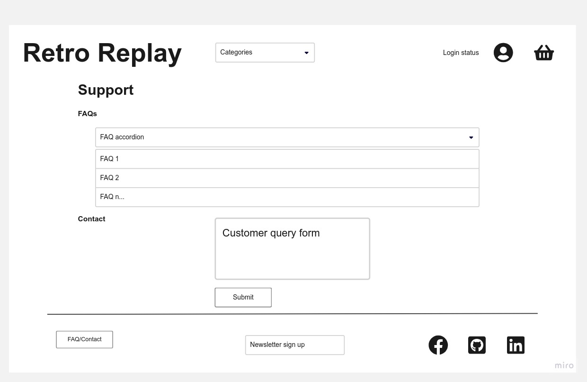
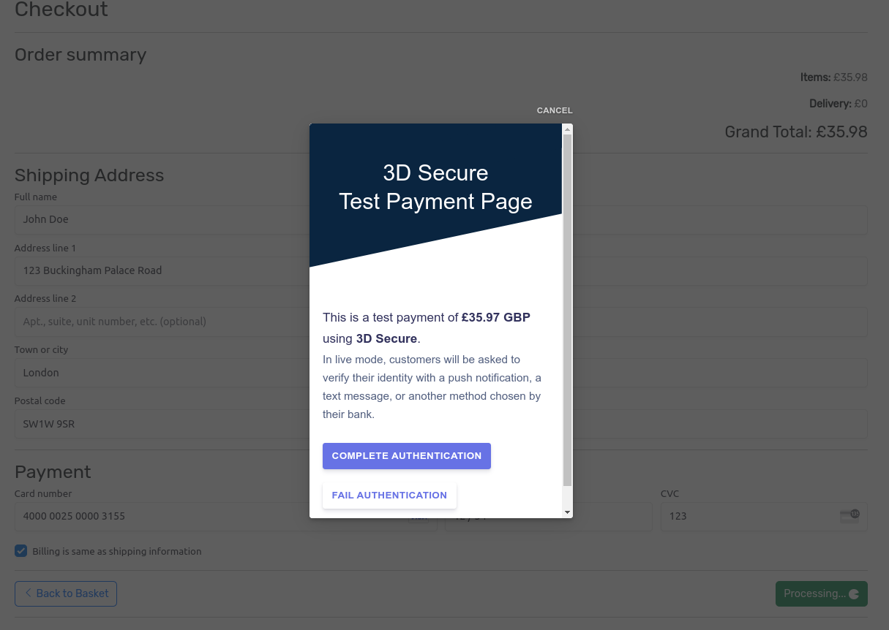

# Retro Replay eCommerce web platform

[Click here to view the deployed site!](https://pp5-retro-replay-f8ca18b6956c.herokuapp.com/)

  
Click to reveal QR code for easy mobile access!

  

The table of contents can be accessed at any time by selecting the menu icon at
the top left of the screen, next to 'README.md'.

Links can be opened in a new tab with a right click, middle click or Ctrl + click.

Getting the most out of this web app requires a verified account. If you would
like to use all features of the site without using a personal email address,
[temp-mail](https://temp-mail.org/) can provide you with a disposable email address.

## Introduction

Retro Replay is a web-based e-commerce platform, powered by Django and Stripe.
It operates on a B2C model, where customers can pay by card for one, or multiple
items in the store. Items are added to their basket, followed by a secure
checkout page. The user is provided with an order confirmation email and they
may view past orders on their profile page.

Additionally, role-based CRUD functions are implemented to benefit the customer.
Customers may store, modify and delete saved addresses on their profile and
nominate one as their default address to speed up their next checkout. There are
lines of support available to customers, facilitated by the FAQ/Contact section.
The administrator can easily create, update and delete FAQ entries entirely from
the front end.

This application expands on my previous [full stack application](https://github.com/jts272/pp4-safe-hands-guitar-tech)
with a complete SEO and marketing campaign, utilizing Facebook and Mailchimp.

## Agile methodologies

An agile methodology was employed from start to finish in this project. For a
detailed breakdown on the implementation, please consult the
[agile methodologies breakdown](https://github.com/jts272/pp4-safe-hands-guitar-tech#agile-methodologies)
outlined in my previous full-stack production. There you will find a thorough
explanation of each component, how to read the visualizations and how they benefit
the development process.

Here are the links to the agile resources for this project. GitHub project boards
are best viewed in 'Board' layout, with the 'Labels' field enabled.

- [Issues](https://github.com/jts272/pp5-retro-replay/issues?q=is%3Aissue+is%3Aclosed)
- [Milestones](https://github.com/jts272/pp5-retro-replay/milestones?state=closed)
- [Projects](https://github.com/jts272/pp5-retro-replay/projects?query=is%3Aopen)

---

## Five stages of UX design

### 1. Strategy

This application is designed to serve the needs of a client that is starting a new
B2C small business. The product is retro video games from the mid-2000's and prior.
The client has no premises overhead and wants an online platform to sell his
products, whilst expanding his audience reach.

The client's target market is mainly well-informed collectors. They generally
know what they are looking for, so the strategy is to make browsing the site
very logical, whilst providing prospective customers with the details they would
be interested in.

One advantage that Retro Replay offers over high street retailers such as
[CeX](https://uk.webuy.com/) is that it sells products from regions outside the
UK. Games from Japan or the US varied much more in the retro-era and are a
commodity to collectors.

When auditing the competition, [ConsoleMAD](https://www.consolemad.co.uk/),
[Retro Games](https://www.retrogames.co.uk/) and [Amazon](https://www.amazon.co.uk/)
were used to gauge functional expectations. The intent is to provide a smooth,
essential navigational experience, whilst building trust that leads to successful
conversions.

### 2. Scope

As an e-commerce application, the following MVP features were identified:

- Logical product category list pages.
- Product detail page with relevant information.
- Role-based authentication and authorization.
- Add to basket > Checkout flow.
- Secure payment integration.
- An integrated SEO and marketing campaign, to expand brand reach.

In addition, front end CRUD functionality is available to both customers and
admin. The intent is to allow both parties to control their relevant data
easily, with a pleasant UX. The admin can easily control the content in the FAQ
section, whilst customers can manage their addresses.

The client, whom will serve as the admin, is familiar with the Django administration
system and wanted a reliable way to manage site data. Product management operations
are conducted on the admin site, as well as the monitoring of customer queries.
Customer queries can easily be made by authenticated users on the front end.

### 3. Structure

Interaction design is critical, especially where payments are concerned. The
navigational flow is consistent, which comprises:

- A responsive header, with product categories, authentication controls and basket
  information.
- Main page content. For example, product pages have a search bar and the selected
  product list.
- A footer with support, marketing and call-to-action social links.

By using the navbar, customers can access the majority of the site in no more
than two clicks. Support is readily accessible in the footer by convention.

Feedback is offered on all interactions, leaving nothing to chance. Examples
include:

- Notifying of login status.
- Informing when an item was added to the basket, with a link to view the basket.
- Confirmation prompt for the deletion of a saved address.

Overall, navigation is intended to feel familiar to users of e-commerce platforms,
whilst keeping them informed every step of the way. By keeping things predictable,
the user can focus on simply finding and purchasing their desired product.

### 4. Skeleton

A mobile-first approach was taken as standard, which is also advantageous in the
app's SEO efforts. Design was optimized from the resolution of 375x667 pixel and
tested all the way up to 2560x1440. Screens as small as 320px in width lose no
functionality, however the burger menu icon is wrapped below the brand header.

To start the navigation story from the home page, the navbar is stylized in such
a way that fans of the [Grand Theft Auto](https://en.wikipedia.org/wiki/Grand_Theft_Auto)
franchise will instantly recognize. Combined with the product category and basket
controls, this alone sets the tone as a place to purchase gaming related goods.

An eye-catching hero image solidifies this notion with a vast array of the sorts
of products that are solid. This is covered with SEO-rich keywords to drive the
point home.

A selection of the newest products are shown. First-time visitors can get a feel
for the products sold, whilst repeat customers can quickly see what is new.

A search bar is present on both the home page and product category list pages.
This serves as a filter for the currently selected category, whilst the home page
search bar functions as does the search in the 'All Products' category.

The typical list > detail view pattern is used for customers to find a product
and easily add it to the basket.

Basket and Checkout pages are intuitive. The checkout page employs the latest
Stripe address and payment elements, complete with validation.

A profile management dashboard is available to authenticated users to manage their
addresses, or view past orders. They are fully informed throughout the process,
wether they have none or multiple addresses. The order history also follows the
familiar list > details pattern.

The following wireframes were produced to plan the skeleton that would form each
section's code, using [Miro.](https://miro.com/app/dashboard/) Pages were developed
in mobile format first then scaled to desktop width. However most wireframes are
depicted in desktop format for the sake of clarity. The mobile home page wireframe
is displayed with the navbar menu expanded.

#### Home page - mobile and desktop

#### Product list - desktop

#### Product detail - card

#### Basket summary - card

#### Checkout - card

#### Support - desktop

#### Saved addresses - desktop

#### Order history list - desktop

#### Order history detail - desktop

### 5. Surface

#### Colour

Colour palette generated at [coolors.co](https://coolors.co/)

Staple black and white was used, with a brand colour reminiscent of
[Rockstar Games.](https://en.wikipedia.org/wiki/Rockstar_Games) In addition,
the semantic colours from [Bootstrap 5](https://getbootstrap.com/docs/5.3/getting-started/introduction/)
were used on buttons and alerts.

The client wanted to use a warm colour tone that looks familiar to seasoned
gamers, without associating with any game platform in particular.

#### Typography

Two fonts are in use:

- [Pricedown](https://www.cdnfonts.com/pricedown.font)
- [Rubik](https://fonts.google.com/specimen/Rubik)

Combined with the colour palette, Pricedown font creates an instant link to the
gaming theme at first glance. It also evokes the retro theme of decades gone past.

Body text is represented by Rubik. It is an easily readable sans-serif font, with
playful rounded edges. This is somewhat similar to the body text in use at
[Nintendo's](https://www.nintendo.com/) official site.

#### Imagery

When providing vintage products to collectors, it is import to provide high-quality
images of the product in question. These were taken from the client's own stock.

The eye-catching hero image was used from a [bossrush.net](https://bossrush.net/2022/07/09/collecting-retro-video-games-is-a-waste-of-money-for-me/)
blog post.

Region flag icons were sourced from [flaticon.com](https://www.flaticon.com/packs/countrys-flags)
to provide a bit of visual flair and context to the region codes. Most collectors
would be familiar with such terms, however this helps to reinforce the intent.
An icon to represent items not found was also sourced from here, although all
current listed products have images present.

Game over 404 image was sourced from [unsplash.com](https://unsplash.com/photos/By-tZImt0Ms)

#### Text content

All text content is originally provided from the client. This includes things such
as:

- Product titles
- Categories
- Product descriptions
- FAQs

In addition, short and long-tail keyword research was undertaken. High-value terms
were implemented in HTML header tags on the homepage to maximize SEO efforts.

Iconography to support text content comes from [Bootstrap Icons.](https://icons.getbootstrap.com/)
A customized SVG was generated from [icons8](https://icons8.com/preloaders/en/search/pac+man)
for the Pac-Man style payment processing icon.

---

## Features

### Navbar

A fully responsive navbar is employed at the top of the site. This includes links
to product categories, authentication controls and basket information. Until the
user is authenticated, all features requiring authentication will redirect the
user to log in when clicked.

The desktop navbar features dropdowns for the user to navigate straight to their
selected category. When logged in, users can go to the profile management page
or view the status of their basket.

### Sign in page

This is the user's entry point to interaction with the site and their data.

### Sign out page

When the user is finished, they may sign out securely.

### Sign up page

Sign up requires an email address, username and password. All must be confirmed
to filter out user error during the sign up process.

### Email verification sent

The email address provided must be verified before the user can access the site's
functions requiring authentication.

### Email verification received

The confirmation email is sent to the email address provided at the sign up process.
The link included in the email is used to go back to the site and confirm the
verification.

### Email verification confirm

Here the user confirms that the email address is correct. Upon confirming, they
are redirected to the sign in page.

### Hero image - mobile

Atop the hero image is a banner notifying users of the free delivery threshold.
The hero image itself hints at the wide range of products available, which is
darkened to improve contrast.

### Home page

A search bar invites the user to search for any product in the store. Introductory
text reinforces the site's purpose, which further implements relevant SEO terms.
The four newest products to the store are depicted here in list-card format, with
a call-to-action to view the product in more detail.

### Footer - mobile

In both mobile and desktop view, the footer holds links to valuable support resources.
Firstly is the FAQs/Contact button, which links to the support page. The externally
hosted privacy policy is viewable.

Users can opt-in the the Newsletter, powered by Mailchimp. Also included are
social call-to-action buttons, which link to Facebook, GitHub and LinkedIn,
respectively. Links open in a new window and context, thanks to properly assigned
HTML attributes.

### FAQ/Contact page - user

This page is the user's first line of support. An accordion details frequently
asked questions, where users can view the associated answer.

If they would like to message the admin directly, they can do so with the query
form that follows.

### Contact query - received by admin

The client wanted to ensure that customers were able to reach him privately and
securely if they encountered any issues. A return email address is provided, which
comes from the logged in user's credentials when they make a query, without
requiring them to input it manually.

It is possible to keep track of wether the customer has been responded to and their
query resolved. This feature is currently the admin user's responsibility to
monitor and can be fleshed out as a front end feature in future iterations.

### FAQ/Contact page - admin

For the administrator, there is no admin contact form. They do however gain the
ability to quickly add edit and delete FAQ entries from the front end.

### FAQ form

The form for admin to add a question is shown here, with validation in effect.
The answer field makes use of a custom [Summernote](https://github.com/summernote/django-summernote)
form widget. This provides an advantage over a standard text field by enabling
WYSIWYG editing for elements such as lists or links.

This is also used in the admin panel for the product detail field, which is currently
used to create product listings on the site for selling.

### Privacy policy

The site's policy was created at and hosted by
[privacypolicygenerator.info](https://www.privacypolicygenerator.info/)

This keeps customers properly informed regarding GDPR and their usage of the site.

### Product list page

The full browser window is displayed in this image, to bring attention to the
url path. Urls have been designed in accompaniment with the models to make for
informative, semantic paths. Here depicts the 'products' app, the 'platforms'
section, then finally the 'filter' - which is the model's name in slug format.

To illustrate another example, a user would navigate to
`/products/regions/ntsc-j/` when they select that particular selection from the
navbar. This leverages Django's design patterns to produce meaningful canonical
urls.

### Product detail - card

All pertinent information on the product's specifics are outlined in the card.
Various actions are available, depending on authorization status, or 'in-basket'
status. A logged in user whom does not have the current product in their basket
can add it from this page.

### Log in to buy - mobile

Unauthenticated users are linked to the login page by a conditionally rendered
button.

### Product added to basket

Users are notified that the product has been added to the basket when the add to
basket button is clicked and are offered a link to view their basket. This message
auto-dismisses after a time or can be dismissed manually.

### Product already in basket

If users attempt to re-add the item to the basket, or navigate back to a product
detail page where the item is already in the basket, they are given the appropriate
message. This message will stay present with no option to dismiss.

### Product detail - slug

As with product listings, the product detail card has a logical endpoint. I had
the idea to use an auto-incrementing slug field, as it is very realistic that
a second listing for a game of the same name could be made in the future.
Thankfully, such a field exists and was implemented using the excellent
[django-extensions.](https://django-extensions.readthedocs.io/en/latest/field_extensions.html)

The provides a nice human-readable endpoint for products, rather than the product's
primary key, or other such non-semantic identifier.

### Basket - dynamic calculations

The following examples demonstrate the calculations that are performed on the items
in the current basket. Note that the basket quantity in the top right reflects
the current number of items in it.

The delivery threshold is taken into account and an appropriate message is displayed.
If the threshold is not met, the user is prompted on how much more they could spend
to qualify for free delivery.

When 'Remove' is clicked, all changes occur instantly thanks to the AJAX implementation.
All calculations are performed to correctly display the new figure.

### Checkout

Stripe provides APIs for address and payment elements, the latest of which were
used in this payment integration.

Full form validation is in effect. An alert is shown above the payment controls
to communicate the most recent error to be fixed.

The address element utilizes the Google Maps API to help the user autocomplete
their address.

3D Secure payments are supported, as an extra layer of security. Whilst the API
logic is running, the 'Pay now' button is changed to 'Processing', with an
animated SVG of Pac-Man to indicate the processing status.

### Checkout summary

Upon payment, the user is redirected to the checkout summary page. They are notified
that they will be receiving an email confirmation and that they can view the full
details of their order history on the site.

Note that the basket it emptied when the transaction is complete and the counter
is set back to zero.

### Checkout confirmation email

Order details are confirmed in an email sent after payment succeeds.

### Profile

Profile management serves as the dashboard for regular user's CRUD functionality.

### Order history list page

A user's list after their first order

This list grows as orders are added. Here shows the orders placed for a different user.

### Order history detail page

Here is the full report of the order, in the form of an itemized bill, with
shipping information

### Saved addresses - none

New users with no saved addresses are greeted with this screen. They are prompted
to select an address as default to speed up their next checkout process, where the
address section of the form with be automatically filled when the saved address
data is passed to the Stripe address elemnt as it is built.

### Saved addresses - one, no default set

In this example, the user has one saved address, but no default set.

### Saved addresses - two; first set as default

Here, the user has added a second shipping address and nominated their first
as the one they'd like to use next checkout.

### Error page - 404

Navigating to a non-existent page on the domain produces a custom 404 error page.
In all instances or error pages, the user is offered a prominent link back home.

### Error page - 403

In this instance, a non-admin user is attempting to access a page that is restricted
to superusers. Again, they are informed of what has occurred and guided back home.

### Error page - 500

Sever errors are also handled with a custom page. This situation was replicated
by the admin user trying to access the address edit page of another user.

### Favicon

[favicon.io](https://favicon.io/) was used to generate a favicon for the site,
using an abbreviated version of the brand for lettering and matching colours.

### Feedback system

Feedback messages have been implemented using a combination of the Django messages
framework and custom JavaScript. It is used to highlight that key actions have
taken place.

An example is shown below when a user updates one of their saved addresses:

Or when a user performs an authentication action, such as logging in:

This system is employed in all situations were CRUD operations are concerned,
aside from in the basket. The basket uses AJAX for instant feedback by manipulating
the targeted elements, such as removing an item from the basket and adjusting subtotals
accordingly.

---

## Web marketing campaign

- FB Business page
- Reciprocal links
- Newsletter
- eCommerce business model in-depth

## SEO implementation

- Step-up from previous considerations
- robots.txt
- sitemap.xml
- meta tags
- rel attrs on external links
- URL design

---

## Data modelling

- PostgreSQL on ElephantSQL
- How to read the graph
- Note on custom models, with images for each

### Header for each model

### Complete schema

---

## Testing

- Intro on nature of testing carried out
- Mention what was automated and what was manual/integration

### Python testing

#### Automated test for each app

#### Coverage

### JavaScript testing

- Table

### Stripe/webhook testing

- Local vs deployed

### UX/User story testing

- Link to project iterations; mention index card presentation

### UI testing

- Mobile-first design
- Each component that was tested for responsiveness throughout development

---

## Validation

- Accessibility and SEO considerations

### HTML validation

Tool: [Nu Html Checker](https://validator.w3.org/nu/)

### CSS validation

Tool: [Jigsaw CSS Validation Service](https://jigsaw.w3.org/css-validator/)

### JavaScript validation

Tool: [JSHint](https://jshint.com/)

- Local = eslint, prettier

### Python validation

https://pep8ci.herokuapp.com/

- Local = ruff, pylance, black

### WAVE accessibility validation

Tool: [WAVE](https://wave.webaim.org/)

### Lighthouse reports

---

## Bugs

- Link to milestones

## Version control

- Conventional commits
- No commented-out code
- Filename conventions
- Settings (pyproject, formatters)

## Deployment

- See PP4 steps where appropriate
- [Boutique Ado guide](https://learn.codeinstitute.net/courses/course-v1:CodeInstitute+EA101+2021_T1/courseware/eb05f06e62c64ac89823cc956fcd8191/40cc2543c48643fda09351da6fa90579/)
- [AWS guide](https://codeinstitute.s3.amazonaws.com/fullstack/AWS%20changes%20sheet.pdf)

### Breakdown by service provider

- Environment
- SECRET KEYS

- GitHub
- Heroku
- ElephantSQL
- Stripe
- AWS

### Cloning

- See PP4 if same

### Forking

- See PP4 if same

---

## Acknowledgements

- Code credit given in comments and docstrings
- Any tutorials if required
- Shoutouts to CI tutors, mentors, students past and present
- Any repos that served as inspiration
- Summary of year's learning
