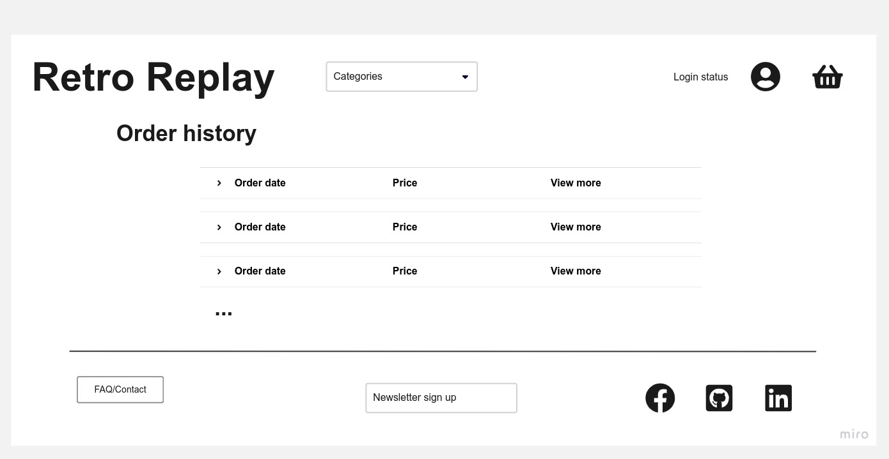

# Retro Replay eCommerce web platform

[Click here to view the deployed site!](https://pp5-retro-replay-f8ca18b6956c.herokuapp.com/)

  
Click to reveal QR code for easy mobile access!

  

The table of contents can be accessed at any time by selecting the menu icon at
the top left of the screen, next to 'README.md'.

Links can be opened in a new tab with a right click, middle click or Ctrl + click.

Getting the most out of this web app requires a verified account. If you would
like to use all features of the site without using a personal email address,
[temp-mail](https://temp-mail.org/) can provide you with a disposable email address.

## Introduction

Retro Replay is a web-based e-commerce platform, powered by Django and Stripe.
It operates on a B2C model, where customers can pay by card for one, or multiple
items in the store. Items are added to their basket, followed by a secure
checkout page. The user is provided with an order confirmation email and they
may view past orders on their profile page.

Additionally, role-based CRUD functions are implemented to benefit the customer.
Customers may store, modify and delete saved addresses on their profile and
nominate one as their default address to speed up their next checkout. There are
lines of support available to customers, facilitated by the FAQ/Contact section.
The administrator can easily create, update and delete FAQ entries entirely from
the front end.

This application expands on my previous [full stack application](https://github.com/jts272/pp4-safe-hands-guitar-tech)
with a complete SEO and marketing campaign, utilizing Facebook and Mailchimp.

## Agile methodologies

An agile methodology was employed from start to finish in this project. For a
detailed breakdown on the implementation, please consult the
[agile methodologies breakdown](https://github.com/jts272/pp4-safe-hands-guitar-tech#agile-methodologies)
outlined in my previous full-stack production. There you will find a thorough
explanation of each component, how to read the visualizations and how they benefit
the development process.

Here are the links to the agile resources for this project. GitHub project boards
are best viewed in 'Board' layout, with the 'Labels' field enabled.

- [Issues](https://github.com/jts272/pp5-retro-replay/issues?q=is%3Aissue+is%3Aclosed)
- [Milestones](https://github.com/jts272/pp5-retro-replay/milestones?state=closed)
- [Projects](https://github.com/jts272/pp5-retro-replay/projects?query=is%3Aopen)

---

## Five stages of UX design

### 1. Strategy

This application is designed to serve the needs of a client that is starting a new
B2C small business. The product is retro video games from the mid-2000's and prior.
The client has no premises overhead and wants an online platform to sell his
products, whilst expanding his audience reach.

The client's target market is mainly well-informed collectors. They generally
know what they are looking for, so the strategy is to make browsing the site
very logical, whilst providing prospective customers with the details they would
be interested in.

One advantage that Retro Replay offers over high street retailers such as
[CeX](https://uk.webuy.com/) is that it sells products from regions outside the
UK. Games from Japan or the US varied much more in the retro-era and are a
commodity to collectors.

When auditing the competition, [ConsoleMAD](https://www.consolemad.co.uk/),
[Retro Games](https://www.retrogames.co.uk/) and [Amazon](https://www.amazon.co.uk/)
were used to gauge functional expectations. The intent is to provide a smooth,
essential navigational experience, whilst building trust that leads to successful
conversions.

### 2. Scope

As an e-commerce application, the following MVP features were identified:

- Logical product category list pages.
- Product detail page with relevant information.
- Role-based authentication and authorization.
- Add to basket > Checkout flow.
- Secure payment integration.
- An integrated SEO and marketing campaign, to expand brand reach.

In addition, front end CRUD functionality is available to both customers and
admin. The intent is to allow both parties to control their relevant data
easily, with a pleasant UX. The admin can easily control the content in the FAQ
section, whilst customers can manage their addresses.

The client, whom will serve as the admin, is familiar with the Django administration
system and wanted a reliable way to manage site data. Product management operations
are conducted on the admin site, as well as the monitoring of customer queries.
Customer queries can easily be made by authenticated users on the front end.

### 3. Structure

Interaction design is critical, especially where payments are concerned. The
navigational flow is consistent, which comprises:

- A responsive header, with product categories, authentication controls and basket
  information.
- Main page content. For example, product pages have a search bar and the selected
  product list.
- A footer with support, marketing and call-to-action social links.

By using the navbar, customers can access the majority of the site in no more
than two clicks. Support is readily accessible in the footer by convention.

Feedback is offered on all interactions, leaving nothing to chance. Examples
include:

- Notifying of login status.
- Informing when an item was added to the basket, with a link to view the basket.
- Confirmation prompt for the deletion of a saved address.

Overall, navigation is intended to feel familiar to users of e-commerce platforms,
whilst keeping them informed every step of the way. By keeping things predictable,
the user can focus on simply finding and purchasing their desired product.

### 4. Skeleton

A mobile-first approach was taken as standard, which is also advantageous in the
app's SEO efforts. Design was optimized from the resolution of 375x667 pixel and
tested all the way up to 2560x1440. Screens as small as 320px in width lose no
functionality, however the burger menu icon is wrapped below the brand header.

To start the navigation story from the home page, the navbar is stylized in such
a way that fans of the [Grand Theft Auto](https://en.wikipedia.org/wiki/Grand_Theft_Auto)
franchise will instantly recognize. Combined with the product category and basket
controls, this alone sets the tone as a place to purchase gaming related goods.

An eye-catching hero image solidifies this notion with a vast array of the sorts
of products that are solid. This is covered with SEO-rich keywords to drive the
point home.

A selection of the newest products are shown. First-time visitors can get a feel
for the products sold, whilst repeat customers can quickly see what is new.

A search bar is present on both the home page and product category list pages.
This serves as a filter for the currently selected category, whilst the home page
search bar functions as does the search in the 'All Products' category.

The typical list > detail view pattern is used for customers to find a product
and easily add it to the basket.

Basket and Checkout pages are intuitive. The checkout page employs the latest
Stripe address and payment elements, complete with validation.

A profile management dashboard is available to authenticated users to manage their
addresses, or view past orders. They are fully informed throughout the process,
wether they have none or multiple addresses. The order history also follows the
familiar list > details pattern.

The following wireframes were produced to plan the skeleton that would form each
section's code, using [Miro.](https://miro.com/app/dashboard/) Pages were developed
in mobile format first then scaled to desktop width. However most wireframes are
depicted in desktop format for the sake of clarity. The mobile home page wireframe
is displayed with the navbar menu expanded.

#### Home page - mobile and desktop

#### Product list - desktop

#### Product detail - card

#### Basket summary - card

#### Checkout - card

#### Support - desktop

#### Saved addresses - desktop

#### Order history list - desktop

#### Order history detail - desktop

### 5. Surface

#### Colour

Colour palette generated at [coolors.co](https://coolors.co/)

Staple black and white was used, with a brand colour reminiscent of
[Rockstar Games.](https://en.wikipedia.org/wiki/Rockstar_Games) In addition,
the semantic colours from [Bootstrap 5](https://getbootstrap.com/docs/5.3/getting-started/introduction/)
were used on buttons and alerts.

The client wanted to use a warm colour tone that looks familiar to seasoned
gamers, without associating with any game platform in particular.

#### Typography

Two fonts are in use:

- [Pricedown](https://www.cdnfonts.com/pricedown.font)
- [Rubik](https://fonts.google.com/specimen/Rubik)

Combined with the colour palette, Pricedown font creates an instant link to the
gaming theme at first glance. It also evokes the retro theme of decades gone past.

Body text is represented by Rubik. It is an easily readable sans-serif font, with
playful rounded edges. This is somewhat similar to the body text in use at
[Nintendo's](https://www.nintendo.com/) official site.

#### Imagery

When providing vintage products to collectors, it is import to provide high-quality
images of the product in question. These were taken from the client's own stock.

The eye-catching hero image was used from a [bossrush.net](https://bossrush.net/2022/07/09/collecting-retro-video-games-is-a-waste-of-money-for-me/)
blog post.

Region flag icons were sourced from [flaticon.com](https://www.flaticon.com/packs/countrys-flags)
to provide a bit of visual flair and context to the region codes. Most collectors
would be familiar with such terms, however this helps to reinforce the intent.
An icon to represent items not found was also sourced from here, although all
current listed products have images present.

Game over 404 image was sourced from [unsplash.com](https://unsplash.com/photos/By-tZImt0Ms)

#### Text content

All text content is originally provided from the client. This includes things such
as:

- Product titles
- Categories
- Product descriptions
- FAQs

In addition, short and long-tail keyword research was undertaken. High-value terms
were implemented in HTML header tags on the homepage to maximize SEO efforts.

Iconography to support text content comes from [Bootstrap Icons.](https://icons.getbootstrap.com/)
A customized SVG was generated from [icons8](https://icons8.com/preloaders/en/search/pac+man)
for the Pac-Man style payment processing icon.

---

## Features

- Include screenshots of everything

### Navbar

- Fully responsive
- Search bar

### Home page

- Introduction
- New arrivals

### Footer

- Newsletter
- Social CTAs

### Pagination of console > item type

- e.g. Console > Region > Games list > game detail

### Product detail page

- Add to basket

### Basket

- Remove products
- Keep shopping

### Checkout

- Confirm address
- Payment integration

### Profile

- Address
- Order history

### FAQ/Contact page

- HTML detail/summary
- Contact

### Error pages

- 404
- 403
- 500

### Favicon

- Where it was made and why

### Feedback system

- Django messages
- Toasts
- Login/registration status

### Admin CRUD functions

- Add, update and deletion of products

---

## Web marketing campaign

- FB Business page
- Reciprocal links
- Newsletter
- eCommerce business model in-depth

## SEO implementation

- Step-up from previous considerations
- robots.txt
- sitemap.xml
- meta tags
- rel attrs on external links
- URL design

---

## Data modelling

- PostgreSQL on ElephantSQL
- How to read the graph
- Note on custom models, with images for each

### Header for each model

### Complete schema

---

## Testing

- Intro on nature of testing carried out
- Mention what was automated and what was manual/integration

### Python testing

#### Automated test for each app

#### Coverage

### JavaScript testing

- Table

### Stripe/webhook testing

- Local vs deployed

### UX/User story testing

- Link to project iterations; mention index card presentation

### UI testing

- Mobile-first design
- Each component that was tested for responsiveness throughout development

---

## Validation

- Accessibility and SEO considerations

### HTML validation

Tool: [Nu Html Checker](https://validator.w3.org/nu/)

### CSS validation

Tool: [Jigsaw CSS Validation Service](https://jigsaw.w3.org/css-validator/)

### JavaScript validation

Tool: [JSHint](https://jshint.com/)

- Local = eslint, prettier

### Python validation

https://pep8ci.herokuapp.com/

- Local = ruff, pylance, black

### WAVE accessibility validation

Tool: [WAVE](https://wave.webaim.org/)

### Lighthouse reports

---

## Bugs

- Link to milestones

## Version control

- Conventional commits
- No commented-out code
- Filename conventions
- Settings (pyproject, formatters)

## Deployment

- See PP4 steps where appropriate
- [Boutique Ado guide](https://learn.codeinstitute.net/courses/course-v1:CodeInstitute+EA101+2021_T1/courseware/eb05f06e62c64ac89823cc956fcd8191/40cc2543c48643fda09351da6fa90579/)
- [AWS guide](https://codeinstitute.s3.amazonaws.com/fullstack/AWS%20changes%20sheet.pdf)

### Breakdown by service provider

- Environment
- SECRET KEYS

- GitHub
- Heroku
- ElephantSQL
- Stripe
- AWS

### Cloning

- See PP4 if same

### Forking

- See PP4 if same

---

## Acknowledgements

- Code credit given in comments and docstrings
- Any tutorials if required
- Shoutouts to CI tutors, mentors, students past and present
- Any repos that served as inspiration
- Summary of year's learning
